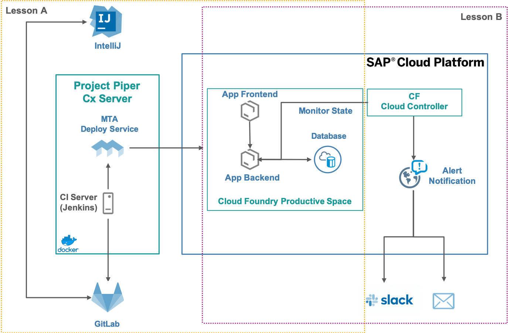

# Description
Welcome to our hands-on session ***CAA381 Taking Your DevOps Skills on SAP CloudPlatform to the Next Level*** which belongs to the learning journey ***Apply DevOps in an SAP solution landscape***. In the next two hours, you will learn and practice how SAP tools help you to build, deliver, and operate high-quality cloud applications that will delight your customers ...and your development team.

# Exercise Landscape 

During this session, we will interact with various tools and systems. The following sketch shows an overview of the flow of our session.

The used landscape consists of the following systems:

* **Timesheet Application**\
The Timesheet Application is the example app that we will use throughout this hands-on session. Each participant will deploy and operate an own instance of this app on SAP Cloud Platform. The application illustrates a typical SAP Cloud Platform scenario: It implements a custom business process for creating and approving timesheet entries. Technically, it is based on the [SAP Cloud Application Programming Model](https://help.sap.com/viewer/65de2977205c403bbc107264b8eccf4b/Cloud/en-US/00823f91779d4d42aa29a498e0535cdf.html) and the [SAP Cloud SDK](https://developers.sap.com/topics/cloud-sdk.html) which is used to integrate with SAP S/4HANA and SAP SuccessFactors. 
 

* **IntelliJ IDEA**\
We will work with IntelliJ as our IDE of choice in this hands-on to edit and push the code of the Timesheet Application.

* **GitLab SCM**\
For central source code management, we will use GitLab. We use a shared source code repository among all participants. It contains an already running version of the Timesheet Application in the master branch. Based on master, each participant will create an individual branch to isolate source code changes from other participants.

* **Project Piper Cx Server**\
Project Piper provides tools for the efficient implementation of Continuous Delivery in the SAP ecosystem. We will use the Piper Cx Server to create an own local Continuous Delivery server instance out-of-the-box. In this pre-configured environment, we will then execute the SAP Cloud SDK pipeline to run the build, tests, quality checks, and deployment of the Timesheet Application.

* **MTA Deploy Service**\
The Timesheet Application project  is built with the SAP Cloud Application Programming Model which uses the [Multitarget application (MTA)](https://help.sap.com/viewer/b017fc4f944e4eb5b31501b3d1b6a1f0/Cloud/en-US/aa0e6f6c2a194a3ba5932b9cf4e78226.html) tooling for packaging and deployment. Multitarget applications allow you handle applications that consits of one or more different components written in different languages as a single deployment unit. The [MTA Deploy Service](https://help.sap.com/viewer/4505d0bdaf4948449b7f7379d24d0f0d/2.0.03/en-US/854a00eb1193486383fc4a97b998dabd.html) takes care to execute enterprise-grade deployments providing you features like blue-green deployment and many more. It also ensures that your application is properly connected to platform services based on codified requirements in your MTA deployment descriptor.

* **SAP Cloud Platform Cloud Foundry Space**\
Every participant has access to a dedicated Cloud Foundry space which can be used with the provided username and password from the handouts on your desks. Furthermore, we will use the following services to observe and operate our application:

   * **Cloud Controller**\
   The Cloud Controller maintains the state of every application running on SAP Cloud Platform. It knows whether the application is started, stopped, crashed or in some other state.
   
   * **SAP Cloud Platform Alert Notification**\
   We are going to use this service to define events (alerts) that can occur with our application (or its dependencies). Once these events occur, the Alert Notification will notify us via various channels. In this hands-on session, we will use it for alerts that notify us about the un-availability of our application services.
   
* **Slack**\
In this session, we will use Slack as the default channel for receiving alerts.

Everything has been already configured for you, so that you can focus on the DevOps topic. Nevertheless, here is a summary of the requirements that are needed if you want to set up the same landscape later on your own:

# Exercises

## Short overview

This hands-on session is structured into two main chapters:

1. **Delivering the Timesheet Application to SAP Cloud Platform:** We will learn how easy it is to establish a Continuous Delivery setup for our application, helping us to quickly deliver high-quality changes into the hands of our end users.

2. **Observing the Timesheet Application:** After we deployed the app, we need to make sure that it runs smoothly and that we can quickly react to problems. We will learn how SAP Cloud Platform helps us to observe the state of our services and how we can be informed about interesting events.

# Before you start

* As the two lessons don't depend on each other, you can start from wherever you like. In 2 hours, you should be able to run both of them. We recommend executing the lessons consecutively. **Only the preparation steps need to be done at the beginning.**
* **Use the provided Student Overview Paper to verify credentials during the hands-on session.**
* Your Teched image will be automatically deleted 5 minutes after the end of the course.

# Preparation (Mandatory)
Preparation is mandatory for both exercises. 

 [Overview and Start](prep/README.md)

## Lesson A – Seting up Continuous Delivery for the Timesheet Application
In lesson A, you will bring your application source code to life by deploying it to SAP Cloud Platform. You might be familiar with complex and slow release cycles in traditional software development. In this lesson, you will learn how you can deliver application changes to production within just a few minutes and without risking significant regressions for your customers. In particular, we will run through the following streamlined steps:

* Setting up a local pre-configured Continuous Delivery server
* Creating a build job for delivering our project with the SAP Cloud SDK Continuous Delivery pipeline
* Configuring the pipeline behaviour for our project
* Analyzing, and fixing a quality issue that the pipeline discovered in our code
* Running the pipeline again, resulting in a successful deployment of our application to SAP Cloud Platform

 [Overview and Start](overviews/A/README.md)

## Lesson B - Observability and Control of your application
In this lesson, you will learn how to observe and control your application after deployment. During this phase, different problems happen (availability issues, performance issues, unexpected load and many more). You will explore SAP Cloud Platform's offerings towards all these potential issues that might appear.

 [Overview and Start](overviews/B/README.md)

# Repeating this Hands-on After Teched

At Teched, everything has been already configured for you so that you can focus on the key topics of this session. Nevertheless, here is a summary of the requirements that are needed if you want to set up the same landscape later on your own:

* **This GitHub Repo will be preserved for your convenience after the TechEd so you can consume the resource anytime**
* To get started with Piper and the SAP Cloud SDK Continuous Delivery Toolkit, check out [this tutorial](https://blogs.sap.com/2017/09/20/continuous-integration-and-delivery/).
* You will need to have an [SAP Cloud Platform](https://cloudplatform.sap.com/index.html) account (CF or Neo environment)
* An active subscription to [Alert Notification](https://cloudplatform.sap.com/capabilities/product-info.SAP-Cloud-Platform-Alert-Notification.df14655e-ee31-45ab-b755-71f869e359c8.html).
* SAP CAP based application. Learn how to build one [here](https://developers.sap.com/group.cp-apm-full-stack-app.html)

# Handy links
* [Blog posts with regards to SAP Cloud SDK and Cx Server](https://blogs.sap.com/2017/05/10/first-steps-with-sap-s4hana-cloud-sdk/)
* [Blog posts with regards to SAP Cloud Platform Alert Notification](https://blogs.sap.com/tag/sap-cloud-platform-alert-notification/)
* [SAP Cloud Application Programming Model](https://help.sap.com/viewer/65de2977205c403bbc107264b8eccf4b/Cloud/en-US/00823f91779d4d42aa29a498e0535cdf.html)

# Contact
This content is currently maintained by 
* [Benjamin Heilbrunn](mailto:benjamin.heilbrunn@sap.com)
* [Vesselin Mitrov](mailto:vesselin.mitrov@sap.com)
* [Kiril Gavrailov](mailto:k.gavrailov@sap.com)

# License
Copyright (c) 2019 SAP SE or an SAP affiliate company. All rights reserved.
This project is licensed under the Apache Software License, v. 2 except as noted otherwise in the [LICENSE file](LICENSE.txt).
