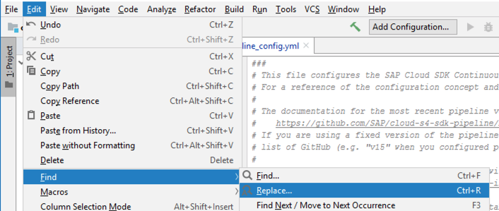
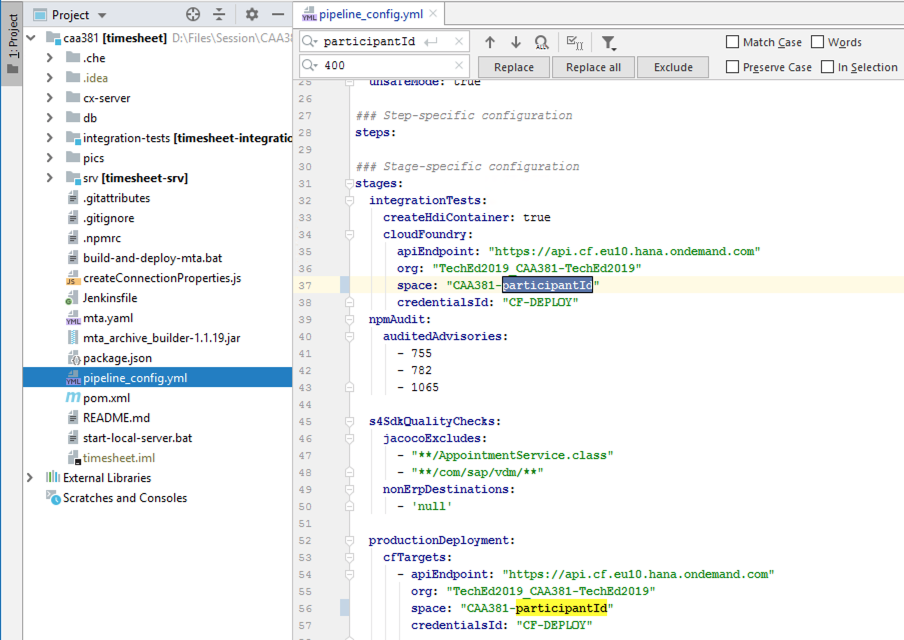
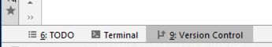
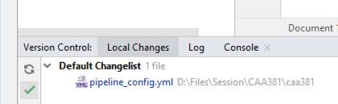
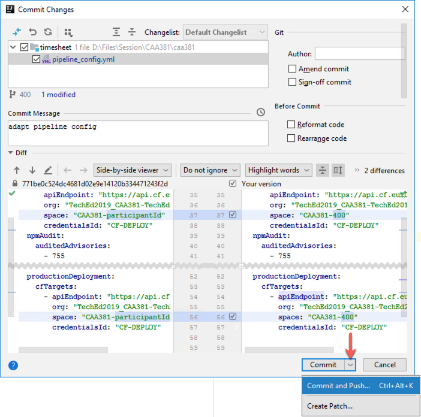

# Lesson A – Setting up CI/CD pipeline

# Ecercise A1 - Starting Your Local Continuous Delivery Server

## Objective
Every software needs a way to be delivered to its consumers. In the cloud world this is done exclusevely by continous delivery systems. This allows developement teams to start easily get the code from their development environment to test environment and then to production. Depending on the release pocess of a development team this can happen either regularly (let's say every two weeks) or immediatelly (whenever the team decides they want a new productive version of their cloud solution).

On top of the Continous Delivery systems come the pipelines, which allow us full automation of our dev-to-production process. The pipelines are a set of multiple steps that should be executed during each phase of moving the solution from one environment tot another. For example during the test phase a set of integration tests should be executed to proceed to production.

Having all of that in mind you can figure out that setup and maintaining such an envionment is not an easy task. With Project Piper Cx Server are making this task trivial. Explore the exercise further to understand how.


### What you will learn during the exercise
* You will learn how to start a Docker container.
* You will learn what Cx Server is.
* You will explore how you can configure a pipleine.

### Estimated Time
25 minutes

## Exercise Steps

1. Start a Docker container with installed Jenkins within it.
2. Customize Your Pipeline Configuration


## Start Jenkins
Let's get our hands dirty and start the Continuous Delivery server on our local machine. All we need is internet access, Docker, and the `cx-server` lifecycle management script. With this script, we can conduct operations such as starting, stopping, and updating our server.

For your convinience, the `cx-server` script is alrady included in the Timesheet Application. From `D:\Files\Session\CAA381\caa381` navigate into the `cx-server` sub-folder. 

> `D:\Files\Session\CAA381\caa381>cd cx-server`

Now, let's execute `cx-server start` to start your personal Continuous Delivery server instance.

> `D:\Files\Session\CAA381\caa381\cx-server>cx-server start`

Docker might prompt you now to share your `D:` Drive. Click on `Share it` and enjoy the show.


Based on the configuration in `server.cfg`, the `cx-server` script will now instanciate a ready-made Continuous Delivery infrastructure on your local machine. This includes:
* A Jenkins server with all necessary plugins and configurations to run our Pipelines
* A read-only download cache based on Nexus to boost the speed of your pipeline runs.

The process might take a minute or two. After its done, the console output of the startup procedure should look similar to the following dump:

```D:\Files\Session\CAA381\caa381\cx-server>cx-server start
Please note that Cx Server on Windows is for convenient development and evaluation.
For running an productive Cx Server, please use a Linux System.
teched: Pulling from ppiper/cx-server-companion
Digest: sha256:446c7a121384133d56c5021914508088b6ac1490aea900c86fcde26f6ed5e952
Status: Image is up to date for ppiper/cx-server-companion:teched
teched: Pulling from ppiper/cx-server-companion
Digest: sha256:446c7a121384133d56c5021914508088b6ac1490aea900c86fcde26f6ed5e952
Status: Image is up to date for ppiper/cx-server-companion:teched
Checking for new version of Cx Server Docker image... 'ppiper/jenkins-master:teched' is up to date.
>> docker network create cx-network
61e27a81b1464cc608e32c47390ea8e15259320a3f7c02bd2247584195a5bdc7
>> docker network connect cx-network 754c4532bf1c07bb4a92887402ad554987d1fd5c2ed7273ec0110496a0008c8b
>> docker pull sonatype/nexus3:3.14.0
3.14.0: Pulling from sonatype/nexus3
Digest: sha256:744c1f7fbf325129ceff0a50ae4587a6145e7f67e2be70c5d0b4e94fd855585f
Status: Image is up to date for sonatype/nexus3:3.14.0
Starting docker container for download cache server.
Parameters:
>> docker run --name cx-nexus --rm --network=cx-network -d sonatype/nexus3:3.14.0
def2be531848ee559e99f711dd34bd3655dc3c259033eac7fe2b5588521ff7a5
Waiting for the nexus server to start............................................ success.
Initializing Nexus
Creating nexus initialization script...
Run nexus initialization script, response: OK
Starting docker container for Cx Server.
Parameters:
   - http_port=8080
   - docker_registry=
   - docker_image=ppiper/jenkins-master:teched
   - jenkins_home=jenkins_home_volume

>> docker pull ppiper/jenkins-master:teched
teched: Pulling from ppiper/jenkins-master
Digest: sha256:66e07587cb9d518019f36a3f8127a12af4bf86456f8203f14280be5ecb2ab4d0
Status: Image is up to date for ppiper/jenkins-master:teched
>> docker run -u 1000:0 --name cx-jenkins-master -d -p 8080:8080 -v /var/run/docker.sock:/var/run/docker.sock -v jenkins_home_volume:/var/jenkins_home -v //
D/Files/Session/CAA381/caa381/cx-server:/var/cx-server:ro -e DL_CACHE_NETWORK=cx-network -e DL_CACHE_HOSTNAME=cx-nexus -e JENKINS_OPTS=--httpPort=8080 --htt
psPort=-1 ppiper/jenkins-master:teched
ca7d0fcab266b2f7ade23455a580780bf1e216756706b7b80f116727299568be
Waiting for the Cx server to start..... success.
```

After you see the success message that indicates that the Cx Server successfully started, open Google Chrome and navigate to `localhost:8080` to open the user interface. 


Woohoo! Our Continuous Delivery server is running. Now we can look into settting up the pipeline for our project. This comprises the following steps: 
* For deploying the application, we need to add the SCP target space to our declarative pipeline configuration. The `pipeline_config.yml` file is contained in our source code repository.
* For running the Continuous Delivery pipeline of our application, we need to create a build job in Jenkins that is linked to our source code repository.

## Customize Your Pipeline Configuration

Thanks to the high degree of standardization in our project, we can adopt the SAP Cloud SDK pipeline without writing a single line of code. For modifying pipeline behavior, we can leverage the declarative `pipeline_config.yml` file which is located in the root of our project. Here we can perform well-defined customizations. In this session, we will use it to define the location of the HANA database which will be used during automated tests and to define the SAP Cloud Platform deploymemt targets.

In this session, the instructors created a SAP Cloud Platform user account and corresponding target space for each participant. So, let's switch back to IntelliJ and add the deployment target of our app to `pipeline_config.yml`.

Locate `pipeline_config.yml` in your project view and open it with a double click. As you can see, the configuration file already contains placeholder configuration entries for the HANA database and for the deployment. In order to make it work, we need to fill the placeholder `participantId` with the id that was assigned to us.

For this, click on `Edit > Find > Replace` like shown below.



Now enter `participantId` as term to be replaced and your personal participant id as replacement. Then click on `Replace all`. Then save the file.



Finally, we just need to commit and push our new configuration to the central source code repository. On the lower left, click on `Version Control` to open the version control pane.



 Now click on `Local Changes` and then on the green "Commit" checkmark.



In the appearing dialog, perform the following steps:
* double check that your participant id is correctly filled into the placeholders in `pipeline_config.yml`
* enter a commit message (e.g., "adapt pipeline config")
* click on the down-facing arrow in the `Commit` button
* select `Commit and Push`



After pushing your changes succesfully, you will see the following pop-up on the bottom right.


 [Overview page](../../README.md) ｜ [ Next Exercise](../A2/README.md)
