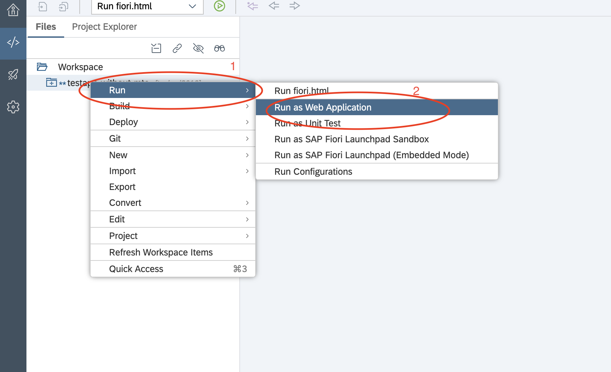
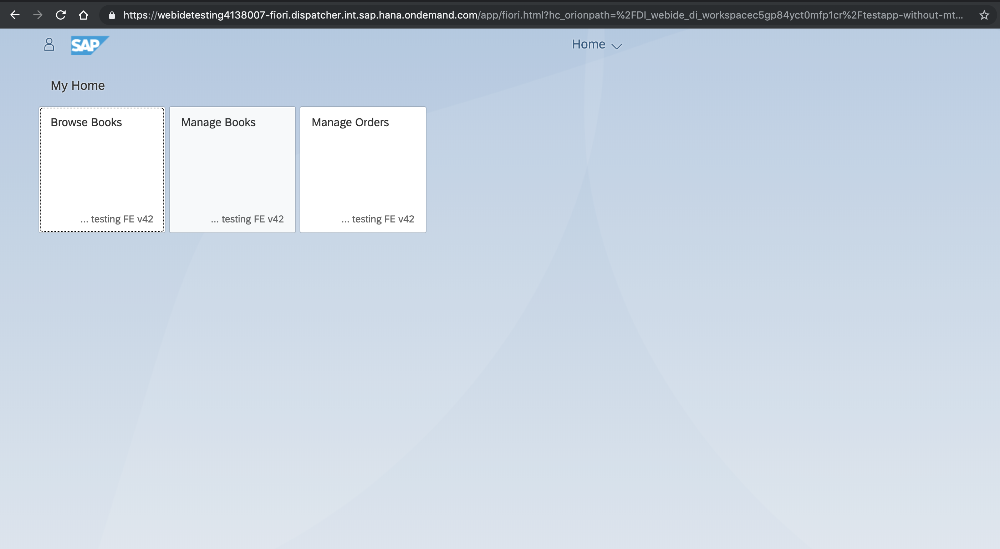
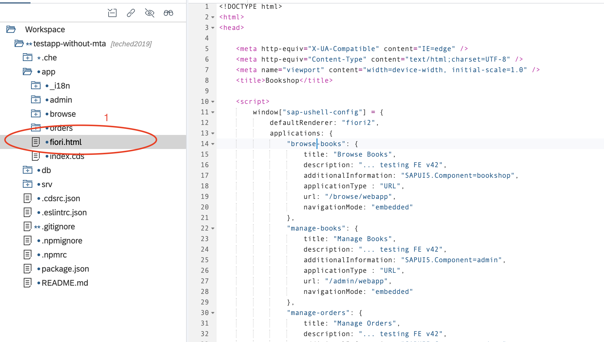
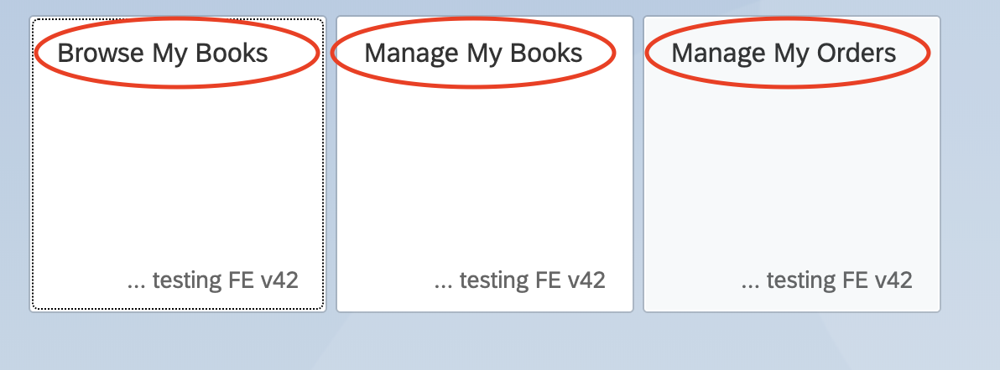

# Lesson A - Modeling and Test of your application
# Exercuse A1 - Make small change and test it into your local test environment

## Objective
You already know abour SAP Clud Application Programming model and you have imported the application into the SAP Web IDE. In that Exercise you will introduce a really small change into he application. The purpose here is not to concetnrate on the coding, but rather to see what is the turnaround of testing such a change. 

### What you will learn during this exercise
You will learn how to make changes into SAP Web IDE and test them immidiatelly into the browser.

## Estimated time
15 minutes

# 1. Let's see how the application looks like
Before introducing the change let us have a look at the appllication UI itself. How to do that? Simply **Right click on the application > Run > Run As Web Application**


The end result should be the Application running 
>Of course not all of the functioanlites of the application will work, since it is wokring only as an UI currently and it is not deployed into the cloud




# 2. Introduce the change
What will be the change? As in many hands-ons you have made so far here you will also introduce a small UI change. Because it is easier and we are all sure that it will work :) For that purpose locate the **fiori.html** file into your Web IDE project, as shown on the picture.



Let's interoduce the followin change: 

**On line 15** - make the label "Browse Books" to "Browse My Books"
**On line 23** - make the label "Manage Books" to "Manage My Books"
**On line 31** - make the label "Manage Orders" to "Manage My Orders"

The code should look like this: 

```
<script>
		window["sap-ushell-config"] = {
			defaultRenderer: "fiori2",
			applications: {
				"browse-books": {
					title: "Browse My Books",
					description: "... testing FE v42",
					additionalInformation: "SAPUI5.Component=bookshop",
					applicationType : "URL",
					url: "/browse/webapp",
					navigationMode: "embedded"
				},
				"manage-books": {
					title: "Manage My Books",
					description: "... testing FE v42",
					additionalInformation: "SAPUI5.Component=admin",
					applicationType : "URL",
					url: "/admin/webapp",
					navigationMode: "embedded"
				},
				"manage-orders": {
					title: "Manage My Orders",
					description: "... testing FE v42",
					additionalInformation: "SAPUI5.Component=orders",
					applicationType : "URL",
					url: "/orders/webapp",
					navigationMode: "embedded"
				}
			}
		};
	</script>
```


In order to verify the changes again **Right click on the application > Run > Run As Web Application** 
The end result should look like this:


[ Previous Exercise](../../preparations/A.md) ｜[ Overview page](../../README.md) ｜ [ Next Exercise](../exercises/A2/README.md)