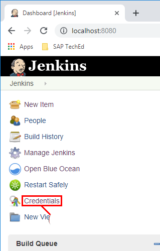
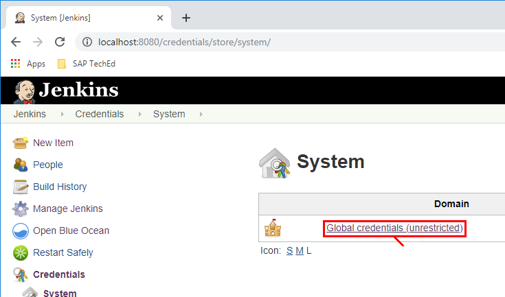
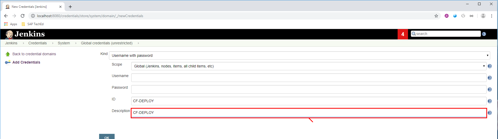
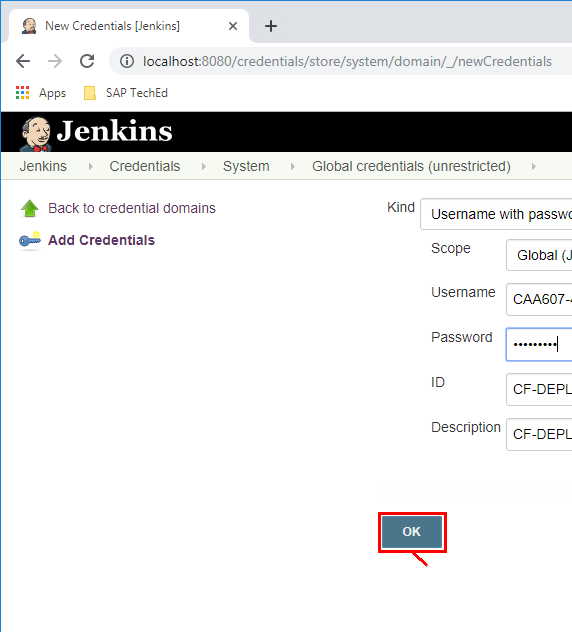

# Lesson A – Setting up CI/CD pipeline
# Exercise A2 - Creating your first pipeline

## Enter Deployment Credentials
Open Google Chrome and navigate to localhost:8080 to open the user interface.

1. Click on **Credentials**.

2. Click on **Jenkins**.

3. Click on **Global Credentials**.

4. Click on **Add Credentials**.

5. In the ID box fill in **CF-DEPLOY**.

6. In the Description box fill in again **CF-DEPLOY**.

7. For user enter **CAA381-\<your partisipantId@teched.cloud.sap>** in the box.

8. For password enter the password provided to you via the paper sheets.

9. Save your changes by clicking **OK**.

10. Go Back to the Jenkins home page.

[ Previous Exercise](../A1/README.md) ｜[ Overview page](../../README.md) ｜ [ Next Exercise](../exercises/prep/B.md)
