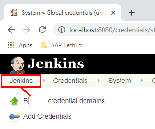
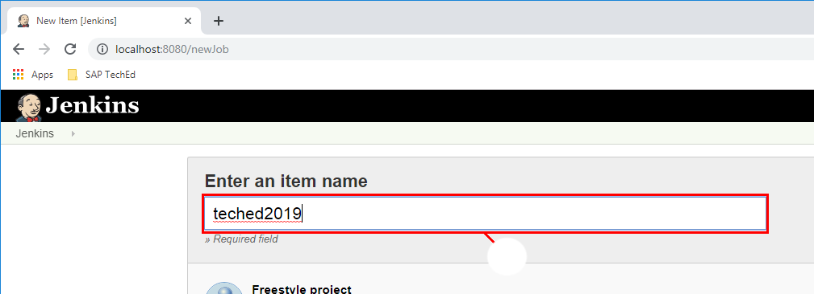
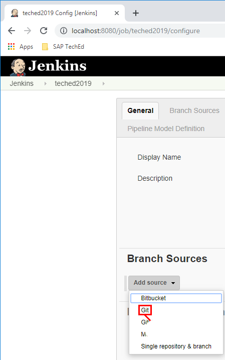
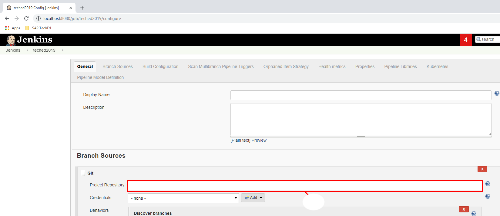
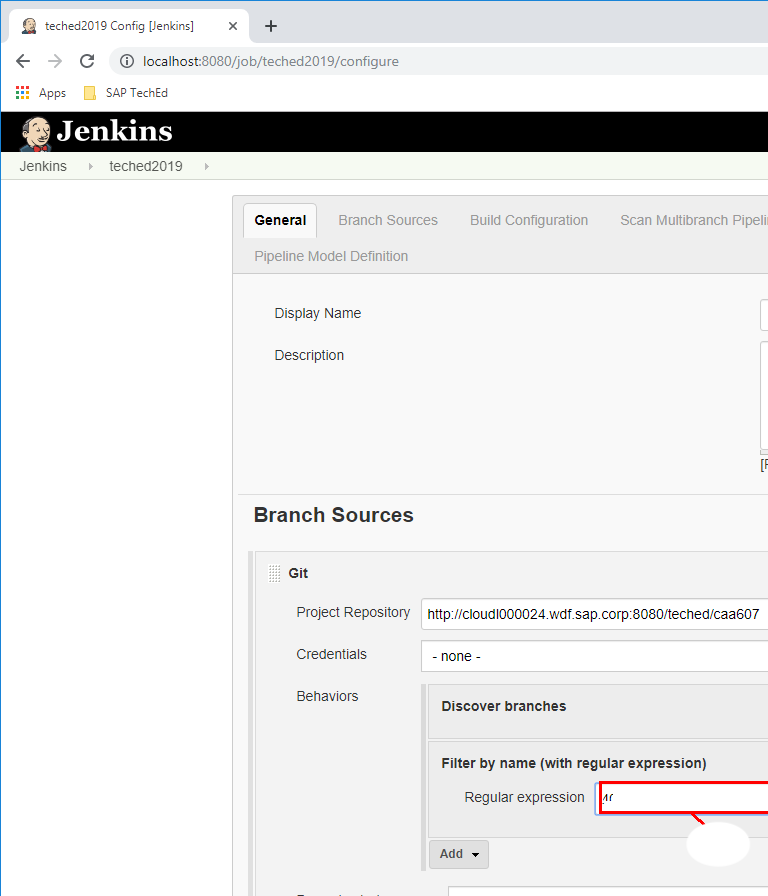
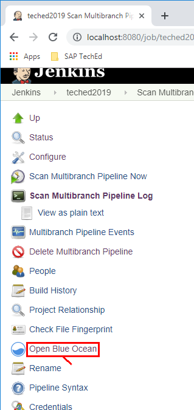
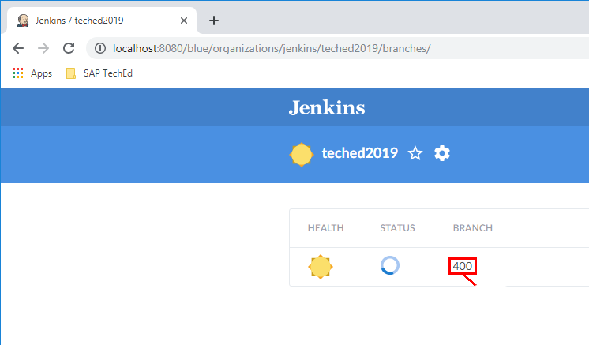

# Lesson A – Setting up CI/CD pipeline
# Exercise A2 - Creating your first pipeline

## Enter Deployment Credentials
Open Google Chrome and navigate to localhost:8080 to open the user interface.

1. Click on **Credentials**.

2. Click on **Jenkins**.

3. Click on **Global Credentials**.

4. Click on **Add Credentials**.

5. In the ID box fill in **CF-DEPLOY**.

6. In the Description box fill in again **CF-DEPLOY**.

7. For user enter **CAA381-\<your partisipantId@teched.cloud.sap>** in the box.

8. For password enter the password provided to you via the paper sheets.

9. Save your changes by clicking **OK**.

10. Go Back to the Jenkins home page.

## Setup Pipeline

Once we have setup our credential it is time to proceed to our pipeline. 

1. On Jenkins home page click on **Create new jobs**.

2. Name the job as **teched2019**.

3. Click on **Multibranch Pipeline**.

4. Click on **OK**.

5. In the Branch Sources click on the **Add Source** dropdown button and select **Git**.

6. As project repository enter **http://cloudl000024.wdf.sap.corp:8080/teched/caa381**.

7. Now in the **Behaviors** section click on the **Add** dropdown buttona and select **Filter by name(with regular expression)**.

8. Your configuration should look like this.

9. Enter in the **Regular Expression** field **your participant id**.

10. Click on **Save**.

11. In the navigation to the left click **Open Blue Ocean**.

12. In the navigation to the left click **Open Blue Ocean**.

13. In the blue ocean click on **your participant id**

14. You now should see your pipeline

[ Previous Exercise](../A1/README.md) ｜[ Overview page](../../README.md) ｜ [ Next Exercise](../exercises/prep/B.md)
