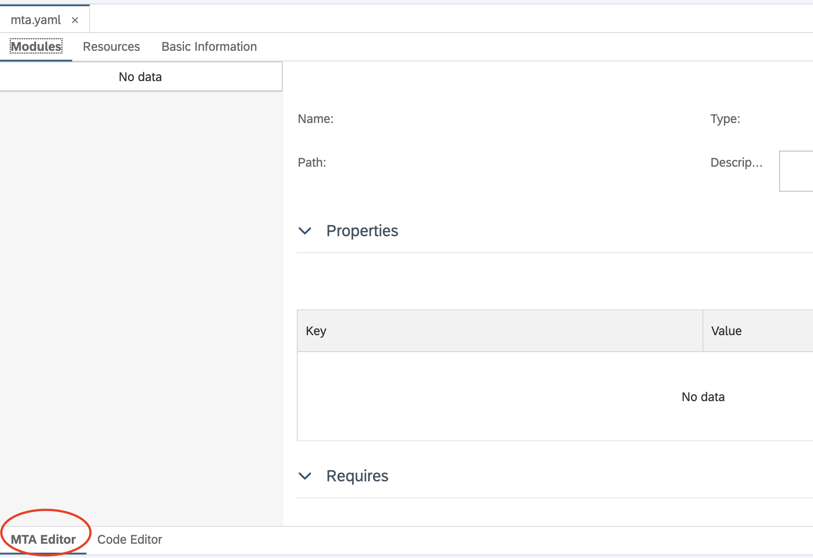
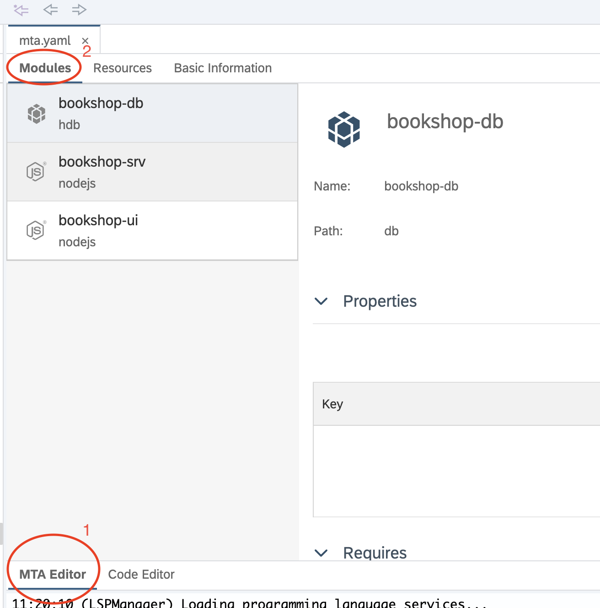
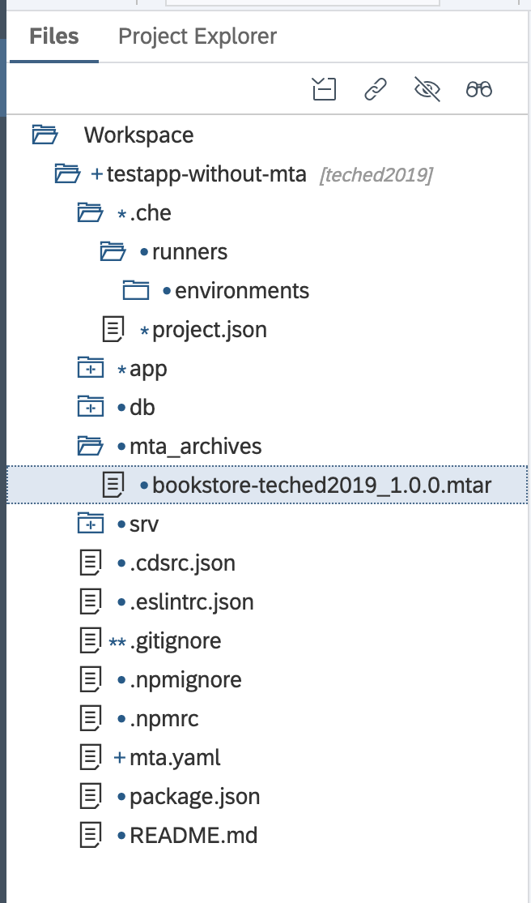
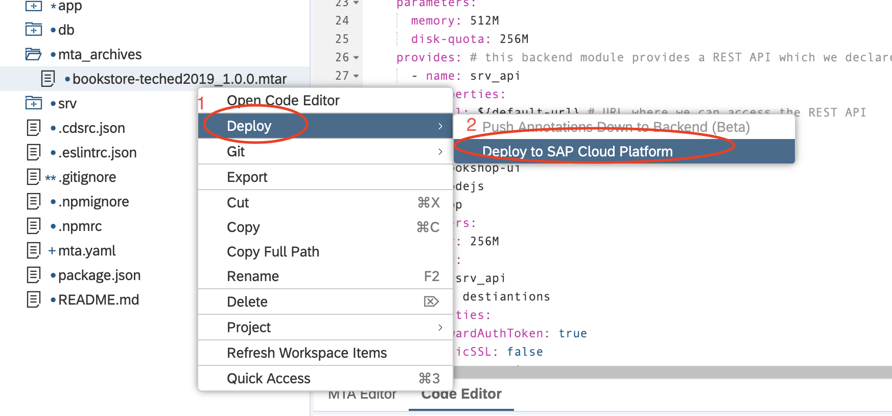
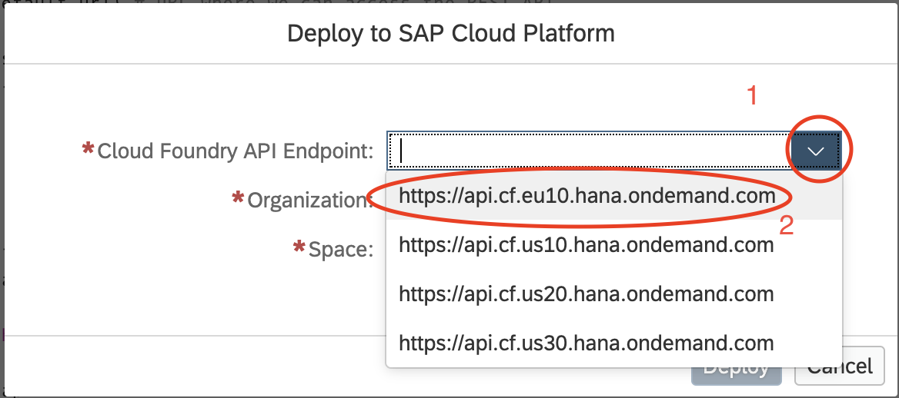
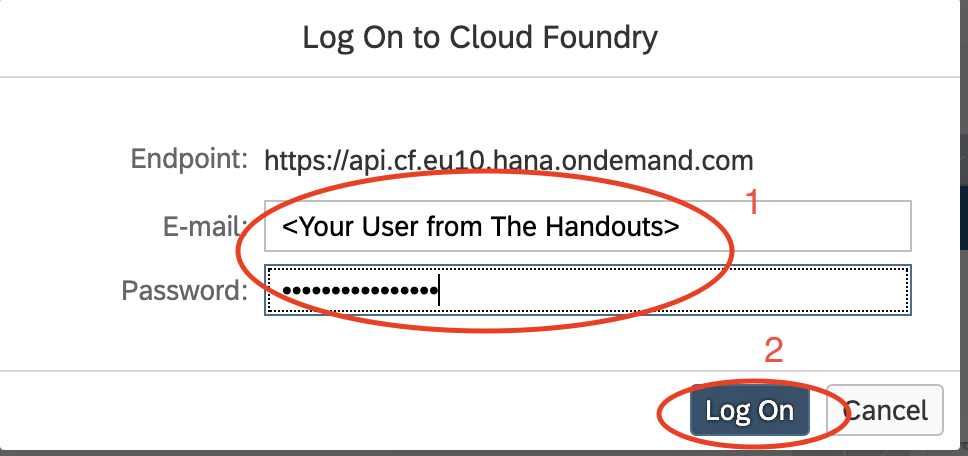

# Lesson A - Modeling and Test of your application
# Preparation - Converting your solution to a Multi-Target Application and test it on SAP Cloud Platform

## Objective
We have made a change in the UI and we have tested it locally. Now it is time to think about deployment. Of course we can deploy the application a component by component, but this in the long term is not a prominent solution. Why? Let's use the application for this handson - it has a database and two separate modules. This means that in Cloud Foundry if we tackle this problem manually we have two approaches: 
1. Code something custom that does the following - on every deployment it first binds the database service instance, then deploys the application modules in a given order. And this thing should be adapted and parametrized for every space and organization that we have. Furthermore this automation should be supported and regularly updated.
2. The second option is to tackle the problem with a declarative appraoch. Here we have many different options. What we would recommend is to use Multi-Target Applications as a part of the best-practices which SAP Cloud Application Programming Model enforces. The purpose of MTAs is to enable you to declaratively describe  the deployment process of your application whitouth much hastle. **This is exactly what we are going to do in this exercise**

We are going to model our CAP application into an MTA deployment with the help of SAP Web IDE. Then we will deploy it into our productive environment from the IDE.

### What you will learn during this exercise
* How to convert your application into a MTA 
* What is the difference between the different modules of an MTA
* How to declare dependencies to your application via MTA
* How to deploy an Multi-Target Application to your SAP Cloud Platform Cloud Foundry space.

## Estimated time
30 minutes 

# 1. Create mta.yaml file
The mta.yaml file is the file which describes our application in a declarative way. There is a special MTA standard fo which you can understand more [here](https://help.sap.com/viewer/65de2977205c403bbc107264b8eccf4b/Cloud/en-US/37eedfdf814d4845ad784334d7ad6f8e.html) 

In order to create our descriptor we simply should create an mta.yaml file into the root of our project. For that purpose **Right clicke on the project > New > File**


In the pop-up window name the file **mta.yaml** and click the OK button. **Note that it is vital to name the file exactly mta.yaml and to put it into the root directory of the project nowhere else**


The yaml file now should be visible in the project


Double click on the file if it isn't open and make sure that the MTA Editor is switched, as shown on the picture.




# 2. Define your MTA

**Note that the MTA editor of SAP Web IDE still evolves so some of the things we should do manually, these will be addressed on a later phase**

First let's fill our basic information, for that purpose **In the opened MTA Editor > Open  Basic Information tab** And add the parametes as shown on the picture below


Once you have done that let's add our resources, this is how we define the database dependency. Click on **Resources > + button**


Let's name the resource. Name it ```bookshop-hdi-container```
and then select its type


From the popup select **com.sap.xs.hdi-container** and left-click it.


>**TODO - Delete in the final version** Refine the properties explanation

Now let's add a property to that resource. Once deployed this container should have a name. In Multi-Target applicatipons you can use parameters to dynamically set different properties whose value you either don't know or you don't want to fill during build-time of your application. In that very exercise this the name of our hdi-container, which we will name after the service that provides the database. For that purpose click on the **+ button** in the properties section.


Add the property key to be ```hdi-container-name``` and the property value should be ```${service-name}```


Once this is done save your mta **Ctrl + S**

We have declared our dependency to a database service. It is time to describe the rest of our application. It consits of three components written in Node.js and HTML5. The Node.js compomnent is in the folder **srv** and it is the backend of our application. The frontend is contained into the **app** folder. There's the UI that we have changed. And in addition we have a database part which takes care for creating the database schema into our dependant service and pours initial data.
For the next part of this exercise we won't use a visual editor but rather edit the mta itself. Let's start with describing the backend. Click on the  **Code Editor** tab below.


Into the appeared code editor we should start declaring our application's different components. Every component is called **module** and they are united under a modules section. Now let's declare our database module by adding the following lines.

```
modules: 
  - name: bookshop-db # Name of the database (you can chose whatever you like)
    type: hdb # hdb indicates that this is of type HANA DB, The types are described in details into the documentation. See useful links for reference
    path: db # path to the module, in our case the db folder
    parametrs: # parameters are reserved variables that affect the behavior of the MTA-aware tools. In that way we can tell the MTA deploy service what memory and disk-quota we will need. And many more
      memory: 256M
      disk-quota: 256M
    requires: # We basically say to the MTA, that this module would need a resource with name "bookshop-hdi-container", which we have already declared
      - name: bookshop-hdi-container
```

What we just did was to declare our database module. And currently our mta.yaml should look like this


Next step is to declare our backend Node.js resource. For that purpose copy and paste the following code into the editor:

```
  - name: bookshop-srv
    type: nodejs 
    path: srv
    parameters:
      memory: 512M
      disk-quota: 256M
    provides: # this backend module provides a REST API which we declare below 
      - name: srv_api
        properties:
          url: ${default-url} # URL where we can access the REST API
    requires: 
      - name: bookshop-hdi-container
```
This is how your mta.yaml should look like


Now what is left is to declare the frontend module

For that purpose paste the following code:

```
- name: bookshop-ui
    type: nodejs
    path: app
    parameters:
      memory: 256M
    requires: 
    - name: srv_api
      group: destiantions
      properties:
        forwardAuthToken: true
        staticSSL: false
        name: srv_api
        url: ~{url}
```
We are almost there. What is left to add the chema version for the MTA. Since Multitarget application rely on a standard, which evolves over time we should specify which version of the standard we want to use. 

To do that, add ```_schema-version: 2.0.0``` **as first line of the file**

This is how our final yaml file should look like: 
```
_schema-version: 2.0.0
ID: bookstore-teched2019
version: 1.0.0
resources:
  - name: bookshop-hdi-container
    type: com.sap.xs.hdi-container
    properties:
      hdi-container-name: '${service-name}'
modules: 
  - name: bookshop-db # Name of the database (you can chose whatever you like)
    type: hdb # hdb indicates that this is of type HANA DB, The types are described in details into the documentation. See useful links for reference
    path: db # path to the module, in our case the db folder
    parametrs: # parameters are reserved variables that affect the behavior of the MTA-aware tools. In that way we can tell the MTA deploy service what memory and disk-quota we will need. And many more
      memory: 256M
      disk-quota: 256M
    requires: # We basically say to the MTA, that this module would need a resource with name "bookshop-hdi-container", which we have already declared
      - name: bookshop-hdi-container
  - name: bookshop-srv
    type: nodejs 
    path: srv
    parameters:
      memory: 512M
      disk-quota: 256M
    provides: # this backend module provides a REST API which we declare below 
      - name: srv_api
        properties:
          url: ${default-url} # URL where we can access the REST API
    requires: 
      - name: bookshop-hdi-container
  - name: bookshop-ui
    type: nodejs
    path: app
    parameters:
      memory: 256M
    requires: 
    - name: srv_api
      group: destiantions
      properties:
        forwardAuthToken: true
        staticSSL: false
        name: srv_api
        url: ~{url}
```
**We are working to provide a more convinient WYSIWYG editor, so in future you won't have to do this with so many writing on the keyboard, instead you'll be able to drag and drop what you need in the editor**

**Optional** You can click back on the MTA Editor tab and then on the Modules tab and you will notice how our MTA visually looks like



# 3. Building you Mutlitarget application archive.

Once you have described the Multitarget application yaml, it is time to package everything together - the descriptor and the binaries. This archive, called mtar will be your deployable unit and will help you deploy everything at once.

To do so **Right click on the project > Build > Build**


> **NOTE** (skip this note if you have managed to execute the previous step succesfully) - this build option **might not** be available. This is due to a glitch which we are in the process of removing. In order to fix this open **.che folder and then double click on the project.json**. Once you paste the file, **delete its contents** and paste the following line ```{"type":"mta","builders":{"default":"mtabuilder","configs":{}},"runners":{"configs":{}},"attributes":{},"description":"","mixinTypes":["fullmtabuild"]}```  and **save** the file. Aftter that **refresh** the browser. The build option should now be available.

The build process will take around 40 seconds. Once it is completed you will be able to find the .mtar file in **project folder > mta_archives > bookstore-teched2019.mtar**



# 4 Deploy your applicaiton to SAP CLoud Platform

After you have tested a change locally and you have desribed your multitarget application it is time to deploy it to the SAP Cloud Platform. For that purpose **Right click on the mtar file > Deploy > Deploy to SAP Cloud Platform**



In the appeared pop-up under **Cloud Foundry API Endpoint** select ```https://api.cf.eu10.hana.ondemand.com```



Logon with your credetntials from the handouts to the CF API Endpoint.



