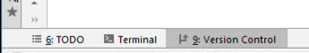
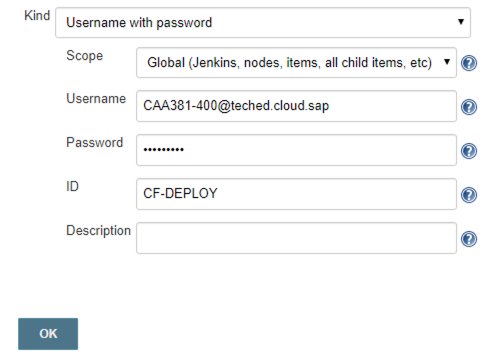

# Lesson A – Seting up Continuous Delivery for the Timesheet Application

# Exercise A2 - Setting Up Your Pipeline

## Objective
Once we have started our Continous Delivery server it is time to build a pipeline. Piplenies are essential to the modern software delivery pocess. They give us a lot - we can make our development-to-production process in phases. During those phases we can run tests, validate our product and make sure that we don't introduce any regressions in our productive version. Furhtermore all of this happens automatically.

Pipelines, however need configuration, but with SAP Cloud SDK and Project Piper Cx Server this configuration is minimal. In that exercise you will understand how to start with a pipeline in just couple of minutes
> TODO

### What you will learn during the exercise
> TODO

## Exercise Steps
* For deploying the application, we need to add the SCP target space to our declarative pipeline configuration. The `pipeline_config.yml` file is contained in our source code repository.
* For running the Continuous Delivery pipeline of our application, we need to create a build job in Jenkins that is linked to our source code repository.
> TODO

## Customize Your Pipeline Configuration

Thanks to the high degree of standardization in our project, we can adopt the SAP Cloud SDK pipeline without writing a single line of code. For modifying pipeline behavior, we can leverage the declarative `pipeline_config.yml` file which is located in the root of our project. Here we can perform well-defined customizations. In this session, we will use it to define the location of the HANA database which will be used during automated tests and to define the SAP Cloud Platform deploymemt targets.

In this session, the instructors created a SAP Cloud Platform user account and corresponding target space for each participant. So, let's switch back to IntelliJ and add the deployment target of our app to `pipeline_config.yml`.

Locate `pipeline_config.yml` in your project view and open it with a double click. As you can see, the configuration file already contains placeholder configuration entries for the HANA database and for the deployment. In order to make it work, we need to fill the placeholder `participantId` with the id that was assigned to us.

For this, click on `Edit > Find > Replace` like shown below.


Now enter `participantId` as term to be replaced and your personal participant id as replacement. Then click on `Replace all`. Then save the file.


Finally, we just need to commit and push our new configuration to the central source code repository. On the lower left, click on `Version Control` to open the version control pane.



 Now click on `Local Changes` and then on the green "Commit" checkmark.


In the appearing dialog, perform the following steps:
* double check that your participant id is correctly filled into the placeholders in `pipeline_config.yml`
* enter a commit message (e.g., "adapt pipeline config")
* click on the down-facing arrow in the `Commit` button
* select `Commit and Push`


After pushing your changes succesfully, you will see the following pop-up on the bottom right.


The project is now fully configured for Continuous Delivery. Wasn't that easy!?
Next, let's configure our Continuous Delivery server.


## Configure Your Continuous Delivery Server

After your project is configured, let's set up the Jenkins build job for running the pipeline. We will first create the necessary deploymnent credentials and then a build job for our project.

Re-open your browser, navigate to the Jenkins user interface (http://localhost:8080).

### Create Deployment Credentials

The Continuous Delivery pipeline of your project will finally deploy to the SAP Cloud Platform space that we created for you for the purpose of this session. Before we can run it, we need to save the deployment credentials in Jenkins. This procedure is a bit cumbersome - so strictly follow the steps described.

* On the Jenkins landing page, look out for the menu on the left and click on `Credentials`.<br>


* Click on the `System` sub-item that appeared below `Credentials`.<br>


* Look out for the `System` section and click on `Global credentials (unrestricted)`.<br>


* In the menu section, you should now see the item `Add Credentials` - click on it.
<br>

* Now you should see the form to enter a new credentials entry. Based on `pipeline_config.yml` which we edited earlier, the pipeline will retrieve the deployment credentials from the entry with ID `CF-DEPLOY`. To create it, enter the following data. Make sure that you use the username and password that was handed out to you.<br>

* Finally, click on `OK` and navigate back to the Jenkins landing page (http://localhost:8080).

Next, we will create the build job for our project.

### Create Build Job

We will now create a build job for our project which will run the pipeline for our branch.

* On the Jenkins landing page, click on `create new jobs`. 
<br>

* Enter `timesheet` as item name. 
* SAP Cloud SDK Continuous Delivery pipelines are designed for multi-branch git repositories. Therefore, select `Multibranch Pipeline` as job type.
<br>
* Finally, click on `OK`.

Next, we will connect the source code repository to the new job.

* In the section `Branch Sources`, click on the button `Add source` and then on `Git`.
<br>

* In the new pane, enter the git url `http://cloudl000024.wdf.sap.corp:8080/teched/caa381` as project repository.

By default, the multibranch pipelines will execute the pipeline for all branches of our repository. This is usually the desired behavior. However, since we are using a joint git repository in this hands-on session, we need to make sure that our build server does not start start executing the pipelines of our co-participants. We can do this by limiting the build job to our branch only:

* Find the `Behaviors` section
* Click on the button `Add`
* In the menu, click on `Filter by name (with regular expression)`
<br>

* Then navigate to the new `Filter by name (with regular expression)` section and enter the name of your branch (participant id) in the text field as shown below.
<br>

* Finally, click on `Save`.

* Now, Jenkins will automatically scan the repository, discover your branch, and then execute the pipeline for it.
Make sure that Jenkins properly detects your branch (and only your branch). The corresponding output should look like the log below.
<br>

## Monitor Pipeline Execution

After Jenkins discovered your branch, it automatically started executing the SAP Cloud SDK pipeline.

Let's inspect the progress of our pipeline execution:
* Go back to the Jenkins landing page on http://localhost:8080.
* You should see the `timesheet` job that we just created.
* The `Build Executor Status` section shows several executors that are running pipeline steps and stages.
* To inspect the execution of our pipeline, let's click on `Open Blue Ocean` in the Jenkins menu. This will bring us to the modernized (but minimal) Jenkins Blue Ocean user interface.<br>

* Click on the `timesheet` job<br>

* Now you see all currently running pipelines of your timesheet job. To inspect the status of your first pipeline run, click on build run `1`<br>


Welcome! This is the SAP Cloud SDK pipeline in action. On top you see the graph visualization of the pipeline gaining shape as the execution progresses. Each bubble in the pipeline graph belongs to a pipeline stage and all stages that are shown on a vertical line are executed in parallel. If you want to understand what's happening in a specific stage, just click on the bubble and inspect the logs shown below the pipeline graph. 

> Note: In our experience, the Jenkins Blue Ocean pipeline view has the tendency to get stuck, often after the end of a stage. Refreshing the browser (press `F5`) helps in such cases to show the latest state of pipeline execution.


> Note: Your first build run will usually take quite some time because the pipeline needs to fetch many project dependencies from the internet. However, thanks to the smart and transparent download cache, follow-up builds will run significantly faster because dependencies will then be resolved locally.

While the pipeline executes, let's get a better understanding of what's going on. The automated pipeline is our primary tool facilitate a quick flow of work from commit to production - because only productively deployed code is good code. Sounds risky? That's why it also acts as a quick feedback giver - because we only want well-working code to be deployed to production.

## Structure of the SAP Cloud SDK Continuous Delivery Pipeline
So, what does the SAP Cloud SDK pipeline particularly do?

* **Bootstrapping:** The SAP Cloud SDK pipeline is fully codified (Pipeline-as-Code). That means that we already did all the hard work for you and you can start using it without writing a single line of code. If you look cloesely, you will find a file called `Jenkinsfile` in the root of your project. This file loads the SAP Cloud SDK pipeline definition from the open source repository on https://github.com/SAP/cloud-s4-sdk-pipeline and starts executing it.

> Note: By setting the property `pipelineVersion` to a specific release of the pipeline, you can fix the pipeline to a specific version. This is recommended for productive projects. Conducting a pipeline update to the most recent release is then just a matter of changing the value of `pipelineVersion`, ideally verified via a pull request.

* **Init:** Once the pipeline defintion is locaded, it runs its `Init` stage. Here, the pipeline loads your project-specific configuration from `pipeline_config.yml` and checks out the source code of your project.

* **Build:** This stage builds the deployable artifact of the application. Since the timesheet application is a SAP Cloud Programming Model based application, this will be an mtar file for us.

> Note: The SAP Cloud SDK pipeline implements the *build-once principle*, i.e., the artifact is used in all follow-up stages without rebuilding (parts of) it. This saves precious time and increases the reliability of the pipeline.  

* **Local Tests:** The local test group executes a family of checks that can be run locally without deploying the application to SAP Cloud Platform. The individual stages are executed in parallel.
    * **Backend Unit- and Integration Tests:** These two stages run backend tests and collect code coverage information.
    * **Frontend Unit- and Integration Tests:** If your project has a frontend, these two stages execute the corresponding unit and integration tests. As you see, no one yet wrote frontend tests for the timesheet application - we should definitely address this in the near future to make sure that we get quickly receive feedback on the functional correctness of frontend components.
    * **Lint:** If the pipeline detects a SAPUI5 frontend in your application, it will automatically execute the SAPUI5 best practice linter. You can use the results to improve your code. If you want, you can also let the pipeline fail based on custom thresholds to enforce quality.
    * **NPM Dependency Audit:** If your project contains JavaScript modules, the pipeline will automatically execute `npm audit` to check whether your project uses vulnerable dependencies. If this is the case, it will let the pipeline fail. You can audit findings and whitelist dependencies via `pipeline_config.yml` if they turn out to be uncritical for you.
    * **Static Code Checks:** The pipeline automatically executes a set of best-practice static code checks. This comprises general coding practices and checks that are specific to the proper use of the SAP Cloud SDK.
* **Remote Tests**: The remote test groups executes checks that require the deployment of the application. The individual stages are executed in parallel. The timesheet app does not have any remote tests yet, therefore this group is skipped by the pipeline.
    * **End-to-end Tests:** Using a simulated browser environment, end-to-end tests ensure that user stories of the application behave as expected when the application is deployed to SAP Cloud Platform.
    * **Performance Tests:** The SAP Cloud SDK SDK supports performance tests with Gatling and JMeter. If your project contains corresponding tests, they will be automatically executed by the pipeline.
* **Quality Checks:** This stage collects telemetry data of unit and integration tests and assures that your application does not violate relevant cloud qualities. It assures that you integrate other services in a resilient manner and that only whitelisted services are consumed from SAP S/4HANA ERP systems. In order to ensure that ensure that enough telemetry data was collected, it also enforces a minimum code coverage threshold.
* **Third-party Checks:** If your company holds a license of *Checkmarx*, *Fortify*, *SourceClear*, *WhiteSource*, you can easily integrate those commercial code scanners into the SAP Cloud SDK pipeline. They will be executed in parallel as part of the Third-party Checks stage. Since such scans tend to run longer, this group is only executed for the productive branch (usually `master`).
* **Artifact Deployment:** If the pipeline runs on the productive branch and all checks succeeded, the artifact can at this point in time be deployed to a artifact repository. This helps you to keep an auditable trail of deployed versions. We don't have a repository configured, therefore, this stage will be skipped.
* **Production Deployment:** If everything went well and the pipeline runs on the productive branch, the application will finally be deployed to the SAP Cloud Platform spaces defined in `pipeline_config.yml`.

## Inspecting The Build Result

After our quick excursion on the pipeline structure, let's check the result of pipeline run:


Oh no! Something went wrong. Obviously the quality checks stage discovered a problem. Let's have a closer look into the logs by scrolling down until we see the error messages. 


The output tells us that our Timesheet application accessed the SAP S/4HANA `EmployeeTime` service in a non-resilient manner. This means that issues during the invocation, e.g., a high network latency or unexpected issues on SAP S/4HANA-side, could cascade to the timesheet application and ,therefore, negatively affect the user experience of multiple end users or even tenants. By properly designing distributed applications such as the timesheet application, this can be easily avoided.

Let's have a look into the code to fix the issue. Open IntelliJ and locate the implementation of the Team Calendar Service (`srv/src/main/java/my/timeheethandson/TeamCalendarService`).


Feel free to have a look at the code and understand what's going on. Do you get a first feeling of what might be wrong?

Let's look closer at the code that reads existing entries from SAP S/4HANA and SAP SuccessFactors.

```
// Read SAP S/4HANA appointments
        final CompletableFuture<List<EntityData>> futureS4Appointments = CompletableFuture.supplyAsync(
                ResilienceDecorator.decorateSupplier(
                        () -> readS4Appointments(persons, year),
                        ResilienceConfiguration.of(WorkforceTimesheetService.class)));

        // Read SFSF appointments
        final List<EntityData> sfsfAppointments = readSfsfAppointments(persons, year);
```


[ Previous Exercise](../A1/README.md) ｜[ Overview page](../../README.md) ｜ [ Next Exercise](../../overviews/B/README.md)
