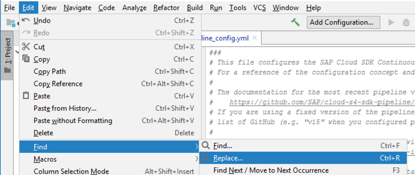
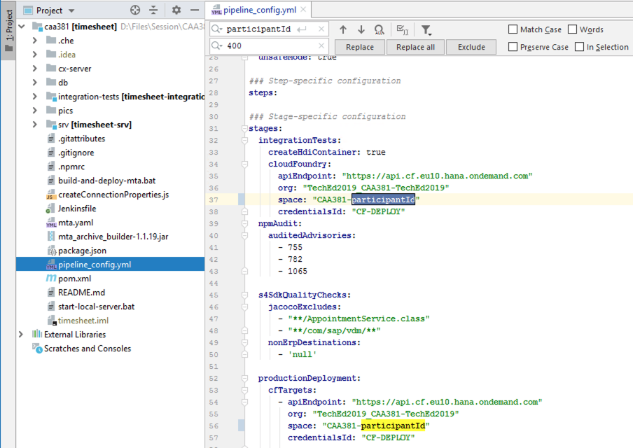
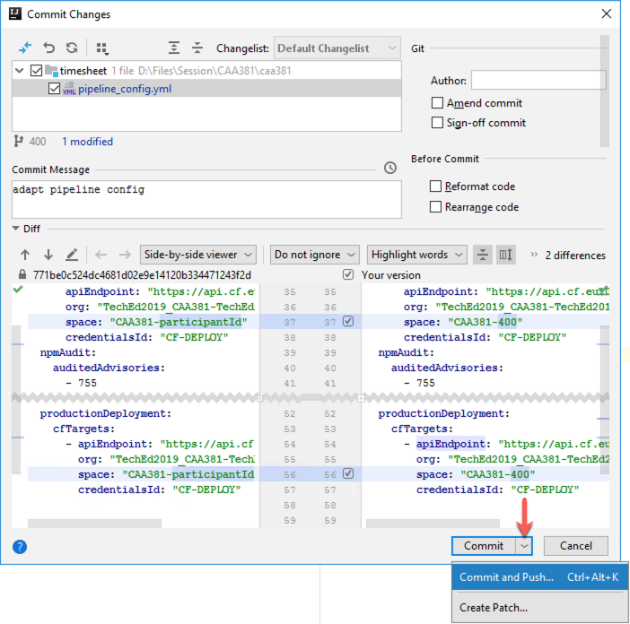
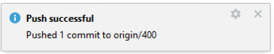
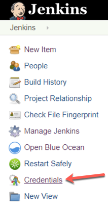
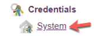
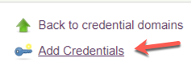
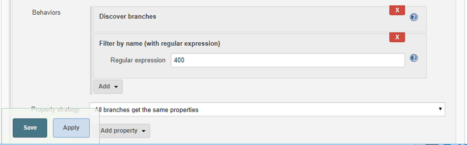
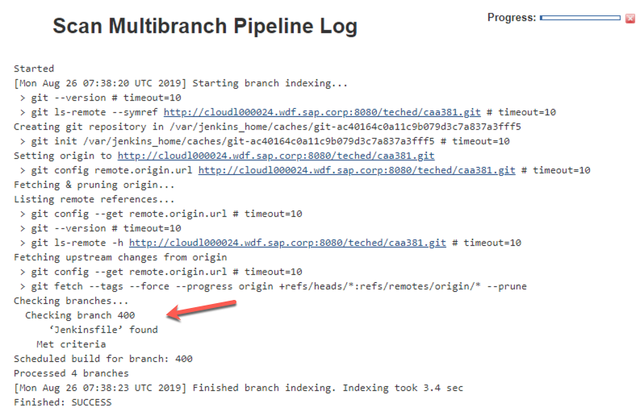

# Lesson A – Seting up Continuous Delivery for the Timesheet Application

# Exercise A2 - Setting Up Your Pipeline

## Objective
Once we have started our Continous Delivery server it is time to build a pipeline. Piplenies are essential to the modern software delivery pocess. They give us a lot - we can make our development-to-production process in phases. During those phases we can run tests, validate our product and make sure that we don't introduce any regressions in our productive version. Furhtermore all of this happens automatically.

Pipelines, however need configuration, but with SAP Cloud SDK and Project Piper Cx Server this configuration is minimal. In that exercise you will understand how to start with a pipeline in just couple of minutes
> TODO

### What you will learn during the exercise
> TODO

## Exercise Steps
* For deploying the application, we need to add the SCP target space to our declarative pipeline configuration. The `pipeline_config.yml` file is contained in our source code repository.
* For running the Continuous Delivery pipeline of our application, we need to create a build job in Jenkins that is linked to our source code repository.
> TODO

## Customize Your Pipeline Configuration

Thanks to the high degree of standardization in our project, we can adopt the SAP Cloud SDK pipeline without writing a single line of code. For modifying pipeline behavior, we can leverage the declarative `pipeline_config.yml` file which is located in the root of our project. Here we can perform well-defined customizations. In this session, we will use it to define the location of the HANA database which will be used during automated tests and to define the SAP Cloud Platform deploymemt targets.

In this session, the instructors created a SAP Cloud Platform user account and corresponding target space for each participant. So, let's switch back to IntelliJ and add the deployment target of our app to `pipeline_config.yml`.

Locate `pipeline_config.yml` in your project view and open it with a double click. As you can see, the configuration file already contains placeholder configuration entries for the HANA database and for the deployment. In order to make it work, we need to fill the placeholder `participantId` with the id that was assigned to us.

For this, click on `Edit > Find > Replace` like shown below.

Now enter `participantId` as term to be replaced and your personal participant id as replacement. Then click on `Replace all`. Then save the file.

Finally, we just need to commit and push our new configuration to the central source code repository. On the lower left, click on `Version Control` to open the version control pane.

 Now click on `Local Changes` and then on the green "Commit" checkmark.

In the appearing dialog, perform the following steps:
* double check that your participant id is correctly filled into the placeholders in `pipeline_config.yml`
* enter a commit message (e.g., "adapt pipeline config")
* click on the down-facing arrow in the `Commit` button
* select `Commit and Push`

After pushing your changes succesfully, you will see the following pop-up on the bottom right.

The project is now fully configured for Continuous Delivery. Wasn't that easy!?
Next, let's configure our Continuous Delivery server.

## Configure Your Continuous Delivery Server

After your project is configured, let's set up the Jenkins build job for running the pipeline. We will first create the necessary deploymnent credentials and then a build job for our project.

Re-open your browser, navigate to the Jenkins user interface (http://localhost:8080).

### Create Deployment Credentials

The Continuous Delivery pipeline of your project will finally deploy to the SAP Cloud Platform space that we created for you for the purpose of this session. Before we can run it, we need to save the deployment credentials in Jenkins. This procedure is a bit cumbersome - so strictly follow the steps described.

* On the Jenkins landing page, look out for the menu on the left and click on `Credentials`. 

* Click on the `System` sub-item that appeared below `Credentials`. 

* Look out for the `System` section and click on `Global credentials (unrestricted)`. 

* In the menu section, you should now see the item `Add Credentials` - click on it.
 

* Now you should see the form to enter a new credentials entry. Based on `pipeline_config.yml` which we edited earlier, the pipeline will retrieve the deployment credentials from the entry with ID `CF-DEPLOY`. To create it, enter the following data. Make sure that you use the username and password that was handed out to you. 

* Finally, click on `OK` and navigate back to the Jenkins landing page (http://localhost:8080).

Next, we will create the build job for our project.

### Create Build Job

We will now create a build job for our project which will run the pipeline for our branch.

* On the Jenkins landing page, click on `create new jobs`. 
 

* Enter `timesheet` as item name. 
* SAP Cloud SDK Continuous Delivery pipelines are designed for multi-branch git repositories. Therefore, select `Multibranch Pipeline` as job type.
 
* Finally, click on `OK`.

Next, we will connect the source code repository to the new job.

* In the section `Branch Sources`, click on the button `Add source` and then on `Git`.
 

* In the new pane, enter the git url `http://cloudl000024.wdf.sap.corp:8080/teched/caa381` as project repository.

By default, the multibranch pipelines will execute the pipeline for all branches of our repository. This is usually the desired behavior. However, since we are using a joint git repository in this hands-on session, we need to make sure that our build server does not start start executing the pipelines of our co-participants. We can do this by limiting the build job to our branch only:

* Find the `Behaviors` section
* Click on the button `Add`
* In the menu, click on `Filter by name (with regular expression)`
 

* Then navigate to the new `Filter by name (with regular expression)` section and enter the name of your branch (participant id) in the text field as shown below.
 

* Finally, click on `Save`.

* Now, Jenkins will automatically scan the repository, discover your branch, and then execute the pipeline for it.
Make sure that Jenkins properly detects your branch (and only your branch). The corresponding output should look like the log below.
 

[ Previous Exercise](../A1/README.md) ｜[ Overview page](../../README.md) ｜ [ Next Exercise](../../overviews/B/README.md)
