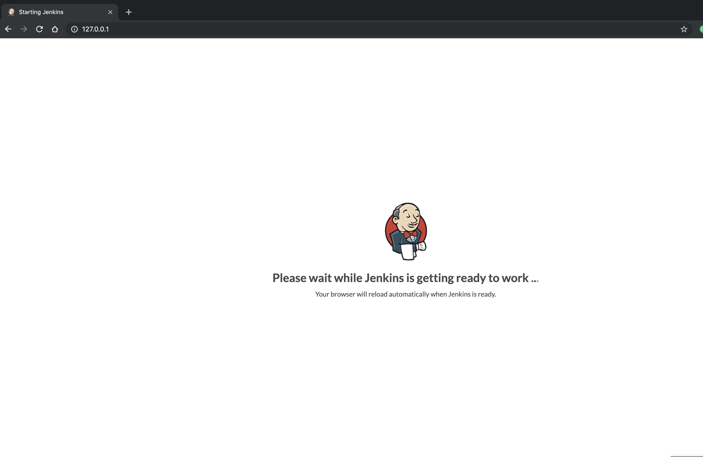
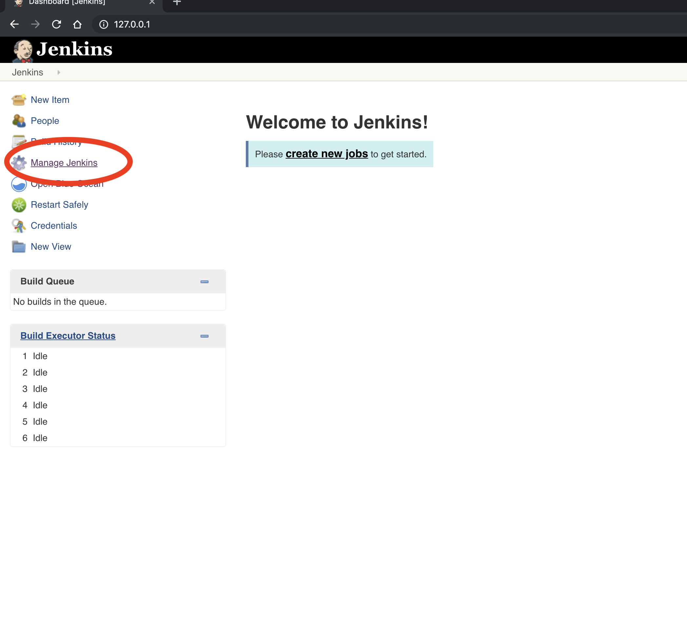
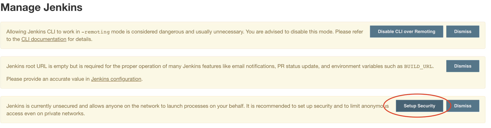
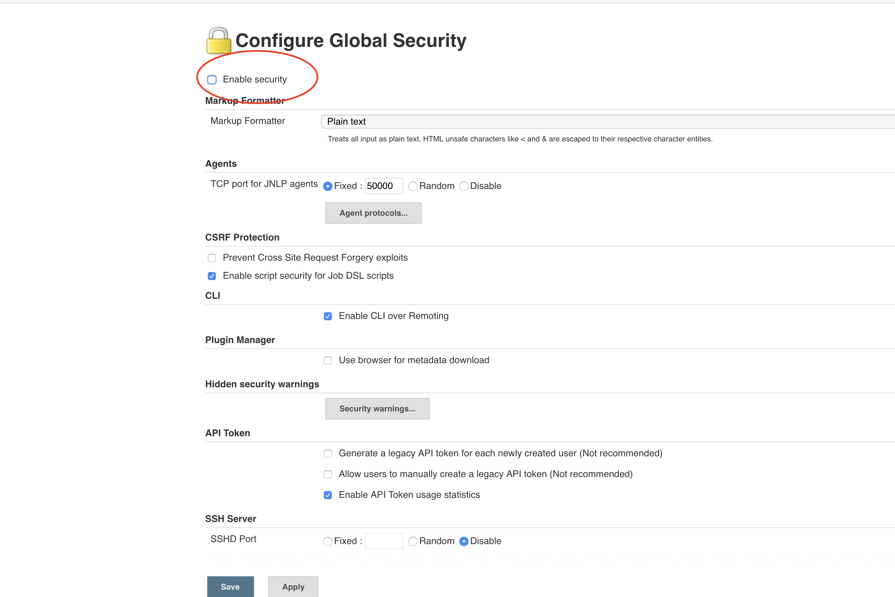
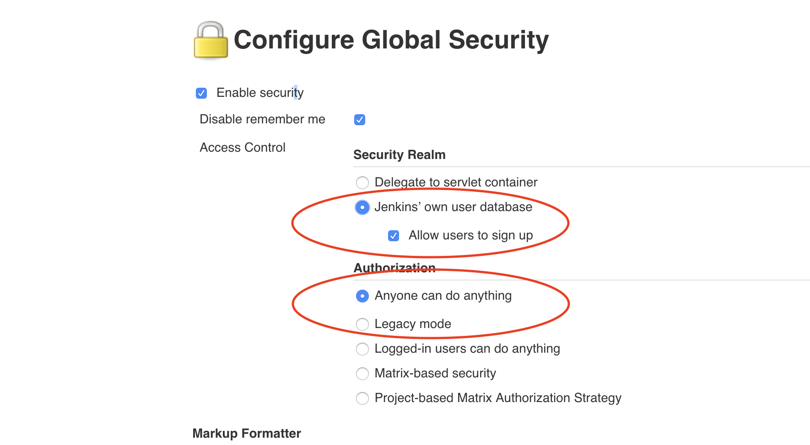
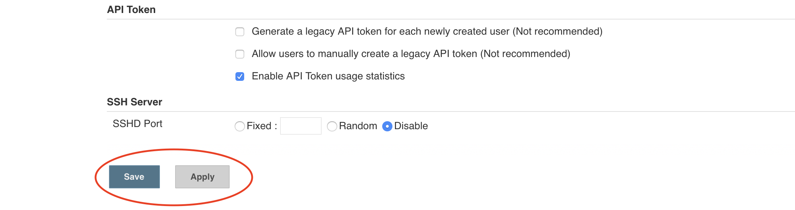

# B1 - Setting up your Jenkins server
### Objective
To setup your CI/CD enviornment you will first need to get the proper infrastructure for that. You will first download a docker image which containse the Cx Server. This will provide us with a jenkins server out of the box running on our client image. After that you will configure the Jenkins security setting in order to be able to configure a pipeline during the lessons.

### Estimated Time
15 minutes

# 1. Downloading Cx Server

> **Note - TO BE DELETED IN THE FINAL VERSION** I am still considering whether making the participants use git on the local image (We have it integrated into both jenkins and web ide). I will give it a day or two more to think.

 **Note - TO BE DELETED IN THE FINAL VERSION** Also the download process might take way too long, I am wondering if this can be downloaded before hand.

1. Open the following [URL]|(https://github.com/teched-test/cloud-s4-sdk-pipeline-docker) - it contains the docker image with the Cx Server.
2. On the right corner click ont the green "Clone or Download" button.
3. Click on the "Downlaod ZIP" button.
4. After the Downlaod is complete, unzip the Cx Server anywhere on the file system 
> **Note - TO BE DELETED IN THE FINAL VERSION** - this will be more clear instruction once we have the images.

# 2. Running the Docker container
> **Note - TO BE DELETED IN THE FINAL VERSION** - this will be more clear instruction once we have the images.

1. In Windows navigate to Start >> Program Files >> Accessories >> Command Prompt
2. In the opened terminal navigate to the unzipped folder on the file system, then enter the directory **s4sdk-jenkins-master**
3. Execute the following command in order to build the docker image. This process will take couple of minutes
``` 
docker build -t s4sdk/jenkins-master-image .
```
4. Afterwards the image is available and a new container can be spawned with following command:
``` 
docker run -p 8080:8080 --name teched-jenkins s4sdk/jenkins-master-image
```
5. Once this done, we are ready to start our jenkins system, to do so navgate to the "cx-server" directory and execute the following command:
``` 
cx-server.bat start
```
6. Once the server is started open your preffered web browser and open the URL - https://127.0.0.1/
7. Note that when you first open the URL you might see the screen below, give it couple of seconds to initialize


# 3. Setting up your Jenkins security

> **Note - TO BE DELETED IN THE FINAL VERSION** - this will be more clear instruction once we have the images.
> **Note - TO BE DELETED IN THE FINAL VERSION** - I am wondering whether not to do this by default in the image instead making the participants doing it.

1. Click on the Manage Jenkins link
 

2. Now click on the "Setup Security" button.


3. Make sure that you have selected the Enable Security checkbox


4. Once you have done that make sure that you have configured the Access Control section as shown on the picture


5. Scroll down and click on the "Apply" and then "Save" buttons


6. Once you do this click on the "Jenkins" header in the upper left corner
7. Let's now create an user - click on the "Sigun Up" link in the upper right corner


8. Fill the form as shown below and click on "Create Account" button


9. **Remember your username and password. If you have followed the instructions they should be user: admin password: admin. Of course you can write anything you want here just make sure to remember it**

[ Previous Exercise](../A2/README.md) ｜[ Overview page](../README.md) ｜ [ Next Exercise](../exercises/B2/README.md)