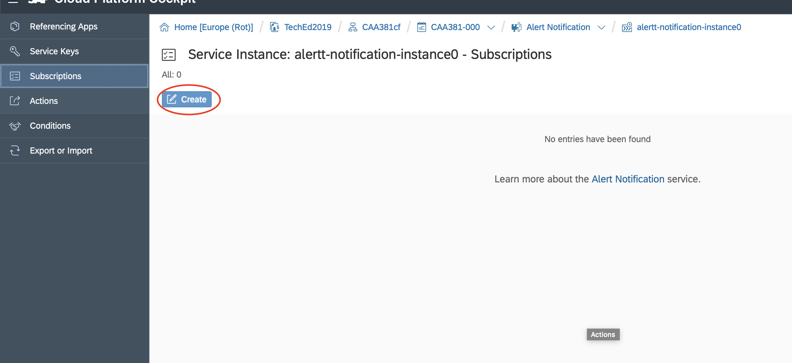

# Lesson B – Observability and Control of your application
# Exercise B1 - Configure Alerts for App State Changes

## Objective
As you can notice from the diagrams, our solution consists of multiple components. It has a front end module, a backend module and a database. One of the most common situations that might happen to us is the crash (or stop) of some of those components. Usually, as  DevOps engineers, we would like to understand about such situations, since this stoppage might be unplanned and we need to react with actions like - restarting the application.

Cloud Controller interacts with applications and allows operators to do actions such as staging applications, starting or stopping applications, collecting health information.

Alert Notification is well integrated with Cloud Controller and it understands for every given event that happens with your application.

### What you will learn during the exercise
* You will explore the Cloud Cockpit.
* You will learn how to configure alerts for app state changes.
* You will explore the different states of a cloud application.
* You will learn how to receive the defined alerts via Slack and/or email.

### Estimated Time
25 minutes

## Exercise Steps

This exercise consists of couple of steps.

1. Subscribe for the alerts coming from Cloud Controller
2. Configure our output channels - like Slack and email.
3. Stop our application and receive the alert.

## Preparation

**You should have your application deployed from the previous Lesson. If you do not have it in your Cloud Platform space, please notify one of the sessions lectors and they will provide it for you.**

## 1. Configure Alert Notification

1. Logon to [Cloud Cockpit](https://account.hana.ondemand.com/cockpit). Use the user and password provided in the hand-out papers on your desk. In the Global Accounts section select **TechEd2019**

2. In the Subacount section select this session's subaccount **CAA381cf**

3. Navigate to the Spaces section and click on your space. **The space name is the same as your username.**

4. Drop down the **Services** section and click on Service Instances. Click on the **alert-notifiction-instance<x>**

5. Open the Subscriptions section and click the **Create** button

6. In the pop-up screen
   1. Fill the subscription name to be **AppHasStopped< The last threedigits of your usernam >**. For example AppHasStopped000. You can set any other name, as far as you can recognize it afterwards.
   2. Under Labels fill **AppStates** and hit enter or tab
   3. Under Condition select **eventType**
   4. From the dropdown select **Is Equal To**
   5. Then in the text field fill **audit.app.stop**
   6. Click on **Create** button

7. On the next screnn click on **Assign**

8. Now it is time to tell Alert Notification where we want to receive those alerts. In the next screen click on the **+ Create Action link**

9. In the next screen select **Slack**. Slack is an cloud-based set of proprietary team collaboration software tools and online services. With Slack you can manager different channels of communication including automatic messaging.
   1. Click on the Slack radio button
   2. click Next
   

10. Finish Slack Setup. Open new tab in your browser and open [this url](https://docs.google.com/document/d/1EqStAAieUaFdvSG-kBsApXZGSpeefsaEBVYNNfAa4VQ/edit) and copy the link provided in it. Back to your Cloud Cockpit.
      1. In **URL Address** paste the copied URL
      2. In the name field type **PostToMySlackChannel**
      3. In Labels type **AppStates** and click tab or enter
      4. Make sure that State is **ON**
      5. Click on **Create** button

> **Note:** Slack is divided into channels, where you can receve your alerts. In order to integrate Alert Notification with Slack, one would need a [webhook](https://en.wikipedia.org/wiki/Webhook). In order not to bother you with Slack configurations we have pre-configured those webhooks for you. However, if you want to learn more how to configure Slack, simply click [here](https://help.sap.com/viewer/5967a369d4b74f7a9c2b91f5df8e6ab6/Cloud/en-US/88a4774f9d3f43259b4dc9e7e7729829.html?q=slack)

11. On the next screen review and click **Assign**. Note that this is a **demo account**, however in productive enrionment you will have to make opt-in from Slack and confirm from within Slack

12. Review the final summary and click **Close**

[ Previous Exercise](../B2/README.md) ｜[ Overview page](../../README.md) ｜ [ Next Exercise](../exercises/C2/README.md)
