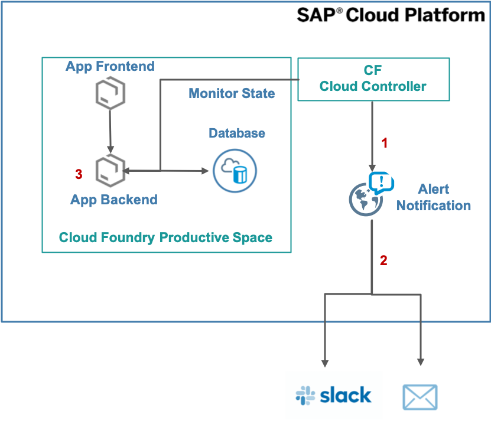
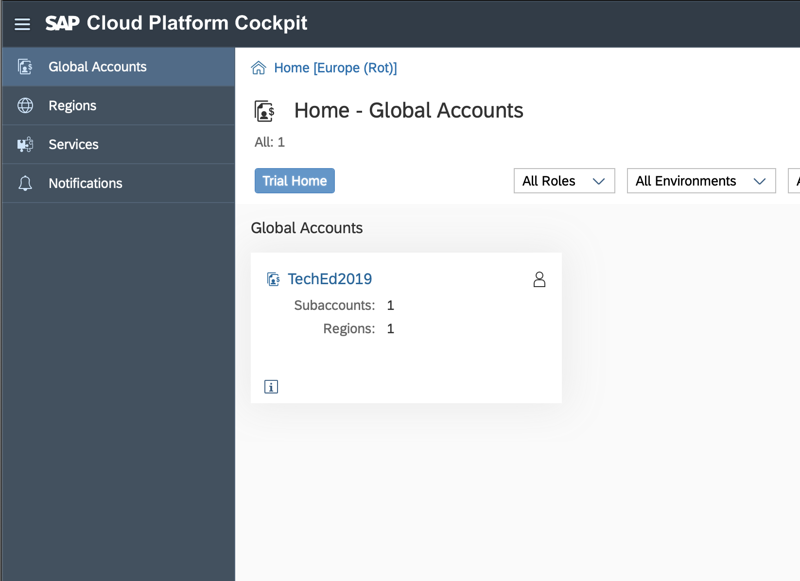
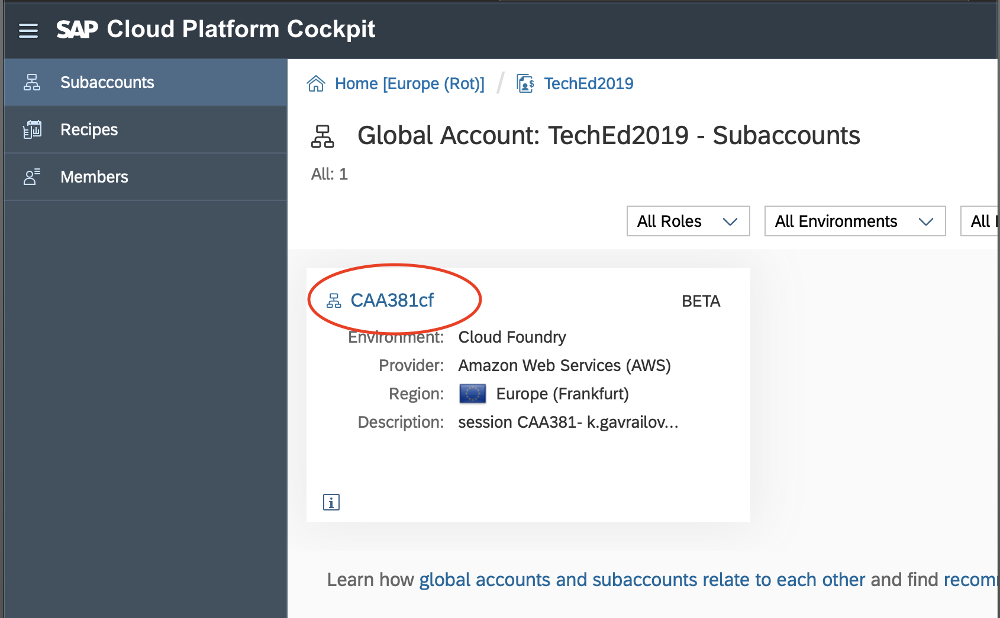
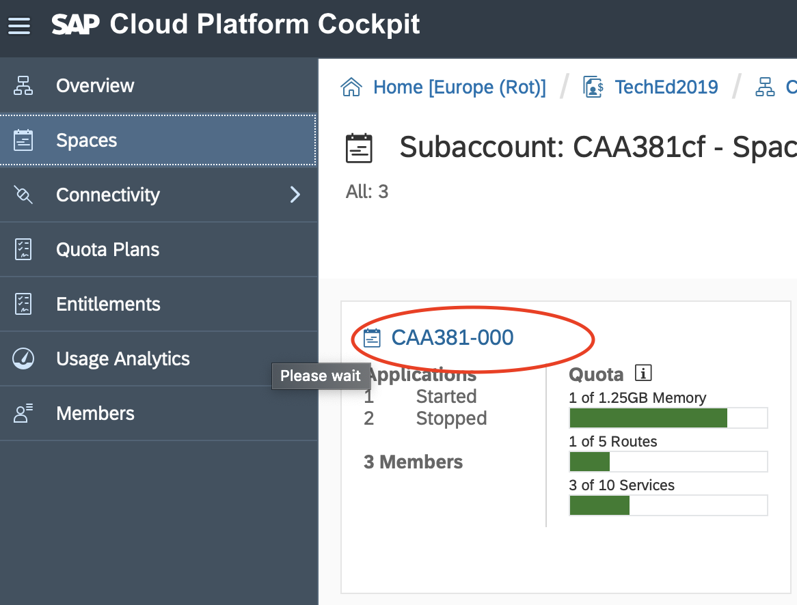
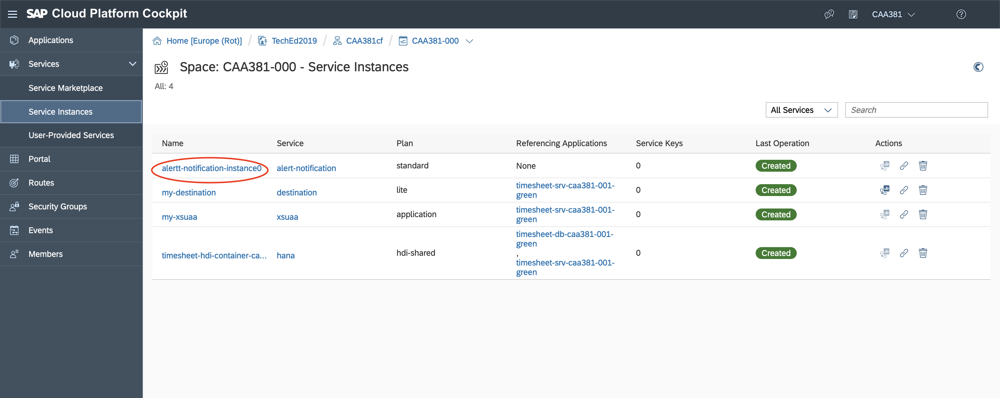

# Lesson B – Observability and Control of your application
# Exercise B1 - Configure Alerts for App State Changes

## Objective
As you can notice from the diagrams, our solution consists of multiple components. It has a front end module, a backend module and a database. One of the most common situations that might happen to us is the crash (or stop) of some of those components. Usually, as  DevOps engineers, we would like to understand about such situations, since this stoppage might be unplanned and we need to react with actions like - restarting the application.

Cloud Controller interacts with applications and allows operators to do actions such as staging applications, starting or stopping applications, collecting health information.

Alert Notification is well integrated with Cloud Controller and it understands for every given event that happens with your application.

### What you will learn during the exercise
* You will explore the Cloud Cockpit.
* You will learn how to configure alerts for app state changes.
* You will explore the different states of a cloud application.
* You will learn how to receive the defined alerts via Slack and/or email.

### Estimated Time
25 minutes

## Exercise Steps

This exercise consists of couple of steps.

1. Subscribe for the alerts coming from Cloud Controller
2. Configure our output channels - like Slack and email.
3. Stop our application and receive the alert.

## Preparation

**You should have your application deployed from the previous Lesson. If you do not have it in your Cloud Platform space, please notify one of the sessions lectors and they will provide it for you.**

## 1. Configure Alert Notification

1. Logon to [Cloud Cockpit](https://account.hana.ondemand.com/cockpit). Use the user and password provided in the hand-out papers on your desk. In the Global Accounts section select **TechEd2019**

2. In the Subacount section select this session's subaccount **CAA381cf**

3. Navigate to the Spaces section and click on your space. **The space name is the same as your username.**

4. Drop down the **Services** section and click on Service Instances. Click on the **alert-notifiction-instance<x>**

[ Previous Exercise](../B2/README.md) ｜[ Overview page](../../README.md) ｜ [ Next Exercise](../exercises/C2/README.md)
