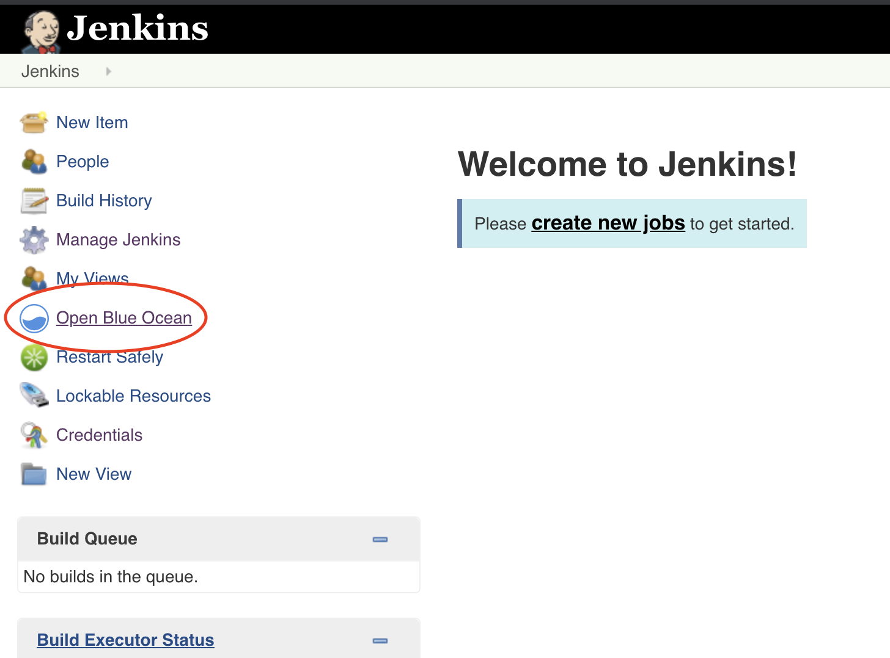
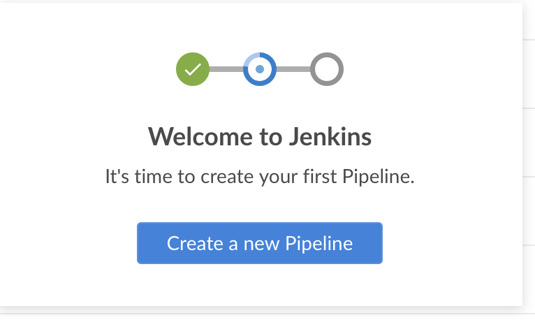
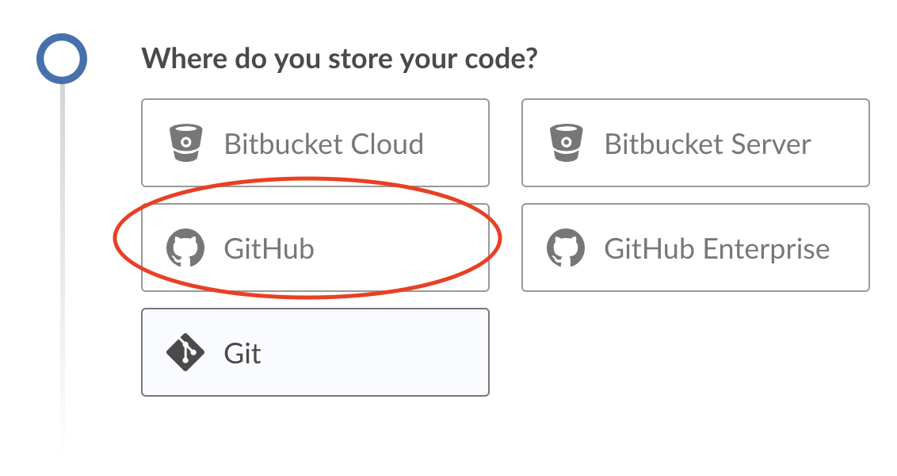
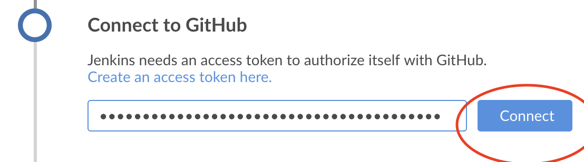
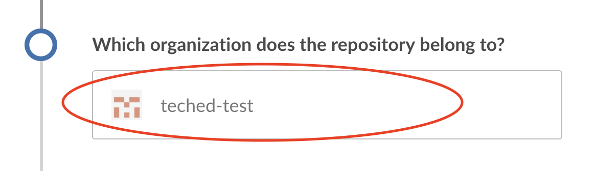
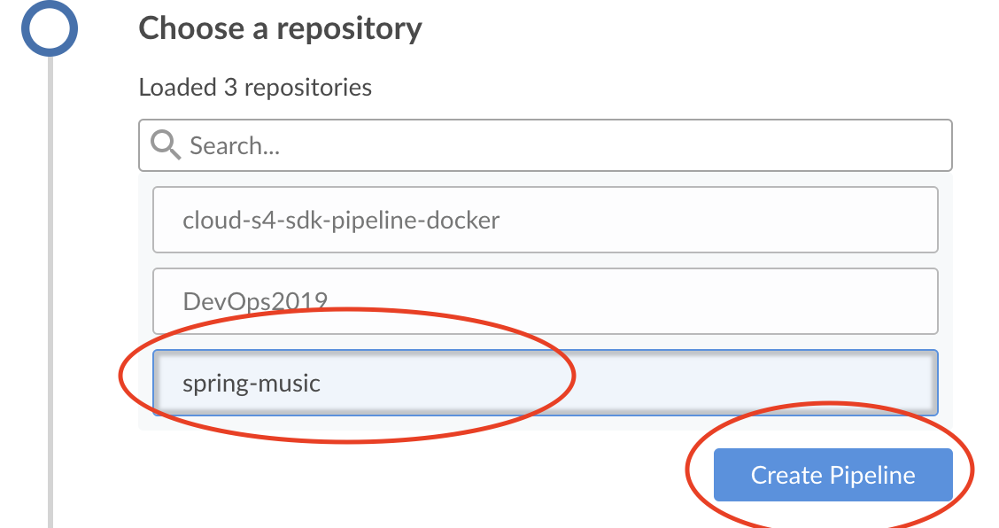
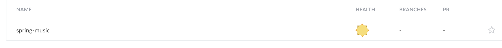

# Lesson B – Setting up CI/CD pipeline
# Exercise B2 - Creating your first pipeline

## Objective
The purpose of this exercise is to get you into a bit more details about our offerings of setting up your CI/CD environment in an easy and 
very intuitive manner. You will use the Jenkins which we have configured and you will see how very easy you can build a pipeline thanks to SAP's offerings.
> Note: Be sure to go through the [preparation](../../prep/README.md) steps before starting this exercise.
## Estimated time
30 minutes

# 1. Introduction to the Cx Server 
> **Note - TO BE DELETED IN THE FINAL VERSION**  More information here is yet to come. Purpose and explanation

# 2. Understanding Jenkins Pipelines
> **Note - TO BE DELETED IN THE FINAL VERSION**  More information here is yet to come. Purpose and explanation

# 3. Creating a Jenkins Pipeline
## 3.1 - Open Blue Ocean

Now, after you know more about Jenkins pipelines we can crearte one. For that purpose we first need to open our Jenkins URL https://127.0.0.1 and log in with the credential that we created in [Exercise B1](../B1/README.md)

After you have done so click on the Blue Ocean pic 

## 3.2 - Start Pipeline creation 
In order to initiate the pipeline creation simply click on the "Create a new Pipeline" button.

> **Note - TO BE DELETED IN THE FINAL VERSION**  More information here about Jenkinsfile and what is its purpose

## 3.3 - Connect the pipeline with your GitHub project 
Now click on the  GitHub button

> **TODO - TO BE DELETED IN THE FINAL VERSION**  Create tinyurl with corresponding access tokens for the project

After you do that you need to provide Jenkins with your GitHub's personal access token. You can obtain this by clicking [here]()

After doing so click on "Connect" button.

## 3.4 - Selecting the pipeline project
Select the organization to which the repository belongs to. This is a single choice so simply click on the "teched-test" label.

## 3.5 - Finalize teh creation 
Once we have selected the organization we should select the repository for which we want to build the pipeline for, in that case this is the "spring-music" repository. Once you select it you can click on the "Create Pipeline" button.

## 3.6 - Check the result
When the creation has finished you will see your pipeline into the Pipelines dashboard.

[ Previous Exercise](../B1/README.md) ｜[ Overview page](../../README.md) ｜ [ Next Exercise](../exercises/B3/README.md)