# Lesson C – Observability and Control of your application
# Exercise B2 - Setting up availability monitor

### Objective
As a DevOps engineer prio 0 for you is to ensure your site availability. Life Site First. In order to achieve this you should be able to proactively understand about potential issues with your application. A cloud application always can encounter many issues - performance, avaialbility, infrastructures and many more. In order to understand about these you have couple of choices:
* To proactively watch a bunch of dashboard and watch for occuring issues.
* To react on a notification that receive via a prferred channel of yours, which will save you a lot of time.

The Alert Notification enables you to do the second one of these two options. In order to start with it we should first subscribe for the service, which is the objective of that exercise

### What you will learn during the exercise
* You will explore the Cloud Cockpit
* You will learn how to create spaces in Cloud Foundry's subaccounts
* You will learn how to subscribe for services in Cloud Foundry environment

### Estimated Time
15 minutes

# 1. Introduction to SAP Cloud Platform Alert Notification
> **Note - TO BE DELETED IN THE FINAL VERSION**  More information here is yet to come. Purpose and explanation

# 2. Subscribing for the service
> **TODO - TO BE DELETED IN THE FINAL VERSION**  Some of the screenshots need to be retaken. We will do this somewhere in June

1. > **TODO - TO BE DELETED IN THE FINAL VERSION**  Instructions for logging in and opening cloud cockpit. I will take the screenshots and wirite the instructions once we have the P-users ready

2. Let's open our subaccount, simply click on its name.
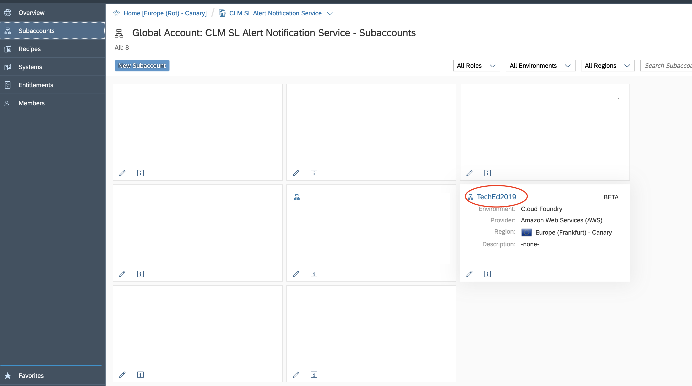

3. Now let's creata a space - in the spaces tab click on "New Space" button.
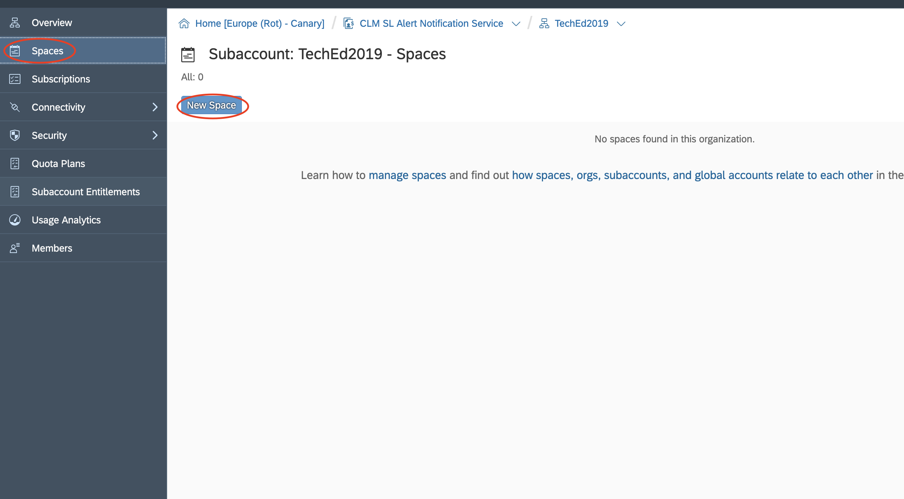

In the pop-up for name of the space enter **[The-provided-P-user]-TechEd2019** and click on the "Save" button. 
> Note: You can name the space you create however you like, so this is just an example.

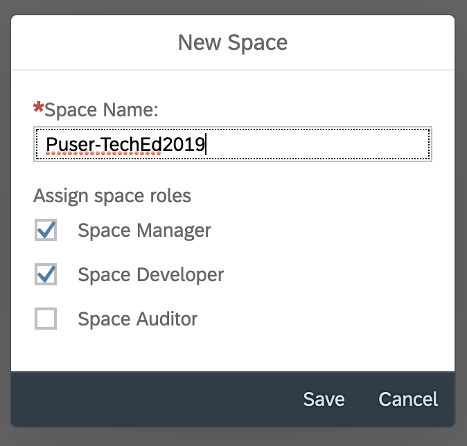

4. After the creation, open the space by going to the Spaces tab and clicking on the name of the space.
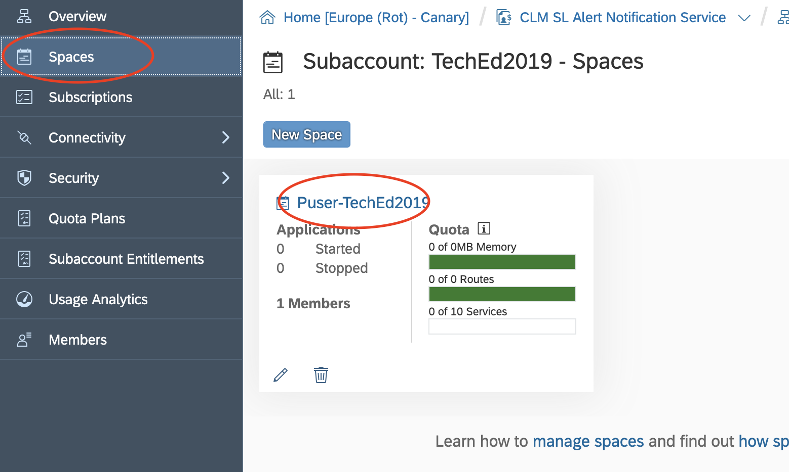

5. Now let's subscribe for the Alert Notification service - in the space go to the "Service Marketplace" tab and click on "alert-notification"
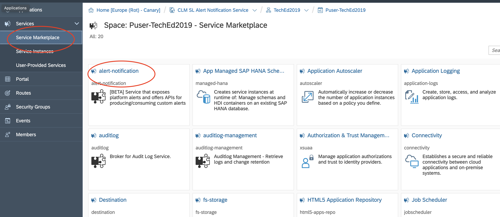

6. In the instances tab of the service click on "New Isntance" button.
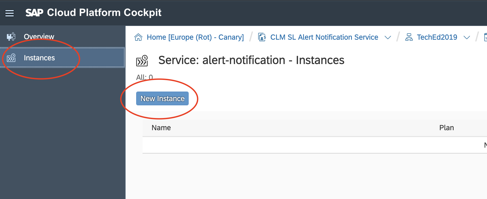

7. In the pop-up that appears click on the "Next" button
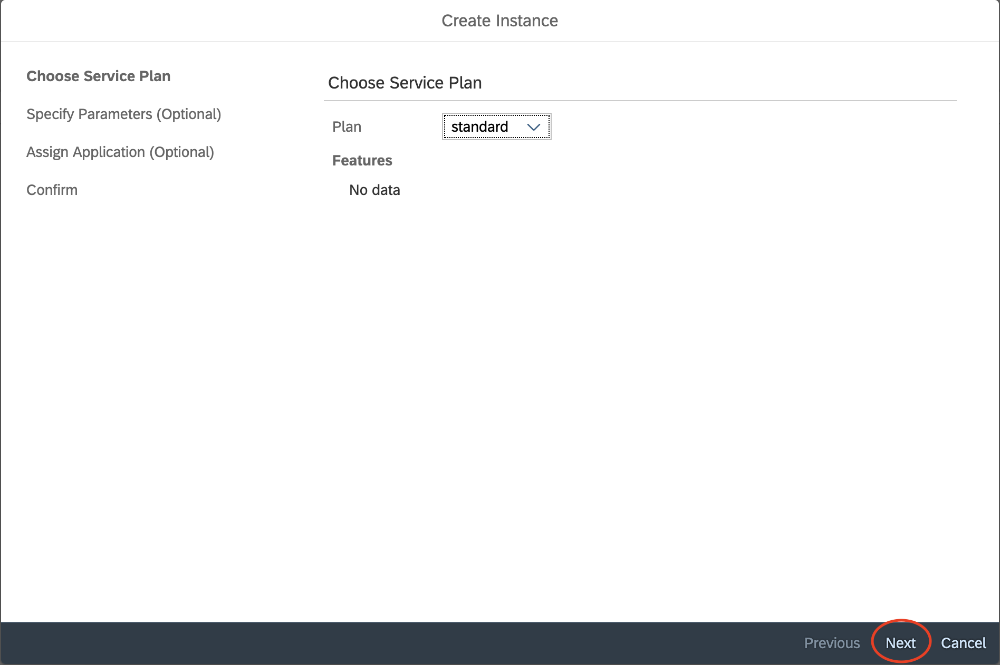

8. And next one more time
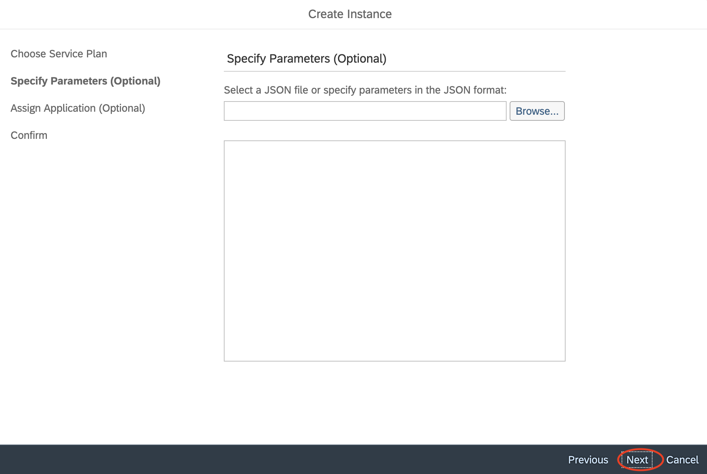

8. And next again
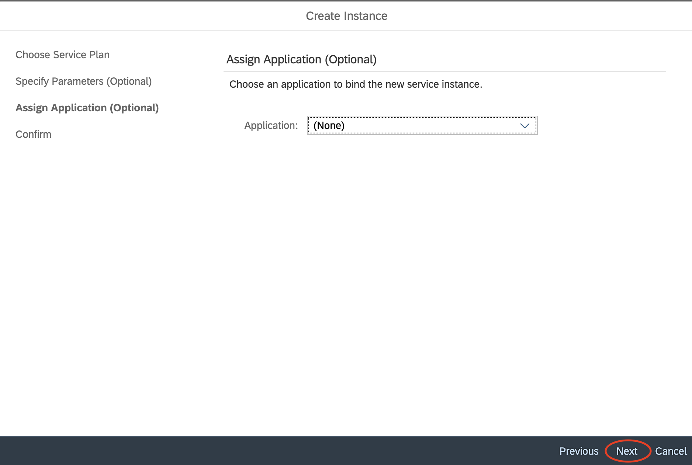

9. Let's name the service isntance you can name it - **2019-teched-an** or whatever you like
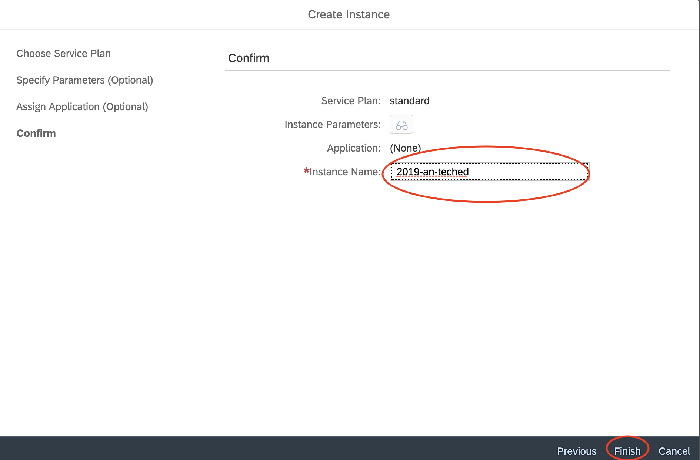

10. The last step is to open the Alert Notification, simply click on its name.
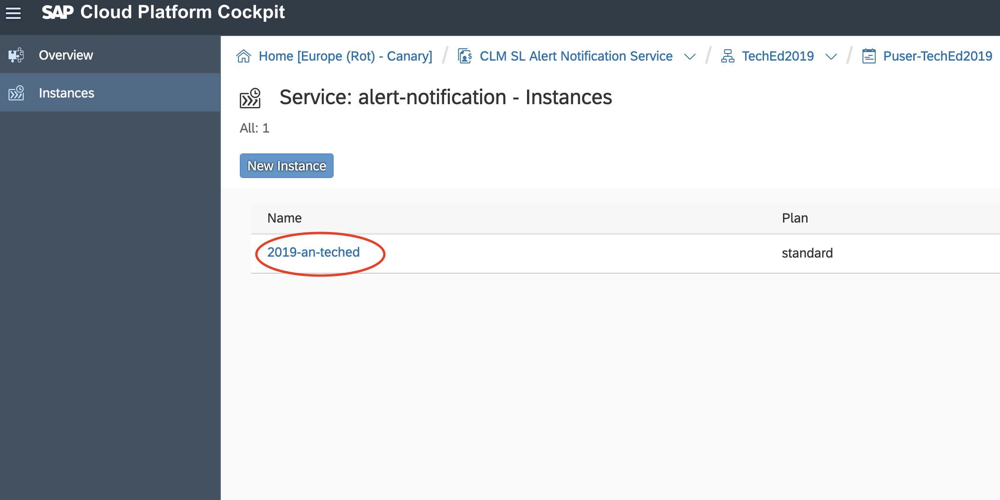

[ Previous Exercise](../B2/README.md) ｜[ Overview page](../../README.md) ｜ [ Next Exercise](../exercises/C2/README.md)