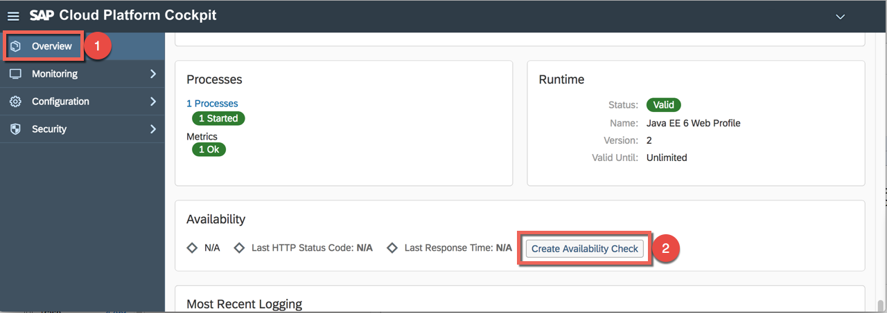
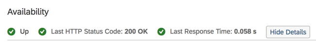

# Lesson C – Observability and Control of your application
# Exercise B2 - Setting up availability monitor

### Objective
As a DevOps engineer prio 0 for you is to ensure your site availability. Life Site First. In order to achieve this you should be able to proactively undetsand about potential issues with your application. A cloud application always can encounter many issues - performance, avaialbility, infrastructures and many more. This exercise we will take care about availability issues. In order to understand that something is going on with our app's availability we should first define an availability monitor.

### Estimated Time
15 minutes

# 1. Introduction to the Availability Service
> **Note - TO BE DELETED IN THE FINAL VERSION**  More information here is yet to come. Purpose and explanation

# 2. Creating an avialability check
> **TODO - TO BE DELETED IN THE FINAL VERSION**  This needs to be adapted heavily. I am now using the standard availability checks but the availability service has so much more to offer. Just waiting for some final technical clarfiications to happen and I will update this one.

1. To monitor whether your deployed application is up and running, you can register an availability check for it. To create it, go back to the Overview section and scroll down to Availability and press the button Create Availability Check.

2. Keep the standard thresholds (Warning & Critical) as they are and press the Save button

> Note: in this example a warning alert will be triggered if the application is not reachable for 50 seconds and a critical alert after 60 seconds.

3. One minute later, you should be able to see the availability status and the response time of the application.

[ Previous Exercise](../B2/README.md) ｜[ Overview page](../../README.md) ｜ [ Next Exercise](../exercises/C2/README.md)