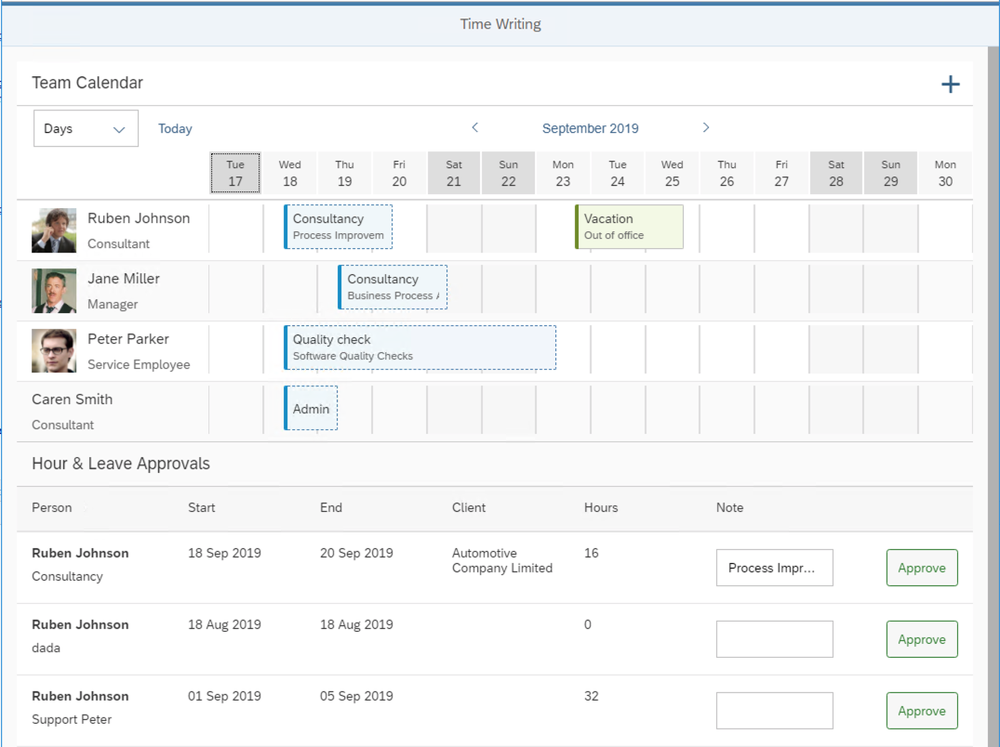

# Lesson A - Seting up Continuous Delivery for the Timesheet Application

Imagine that you freshly joined a new development team. The team is new to cloud development and started recently to work on a new project, the Timesheet Application.



The Timesheet application helps companies to implment an approval workflow for the tracking of employee working hours. To benefit from the unique opportunities of building applications in the cloud, the team decided to build the Timesheet application on SAP Cloud Platform. Thanks to the SAP Cloud SDK, the team was quickly able to build the necessary integrations to SAP SuccessFactors for retrieving employee data and SAP S/4HANA for storing timesheet entries. The webservices and the persistence for timesheet entry drafts are implemented based on the SAP Cloud Application programming model.

Thanks to your productive colleagues, the application is already in a good initial state. Now your Product Owner wants to start to roll out the application to first customers to gather their feedback. It is expected, that those customers will have a lot of feedback and your team wants to be able to quickly react to it. Furthermore, as with every new application, customers might run into glitches that you didn't discover during development. Therefore, your team wants to be able to confidently deliver new versions of the Timesheet Application on a sub-daily basis - in short your team wants to start practicing *Continuous Delivery*. This requires a high level of automation of your whole build, test, quality assurance, and delivery activities, typically achieved by the implementation of a Continuous Delivery pipeline. 

Implementing and maintaining Continuous Delivery environments and pipelines is a challenging task that requires special expertise and an increasing amount of effort as your application and pipeline matures. In many development teams, this becomes the full-time job of a team member. Imagine how much additional customer value you could create if this person would be relieved from his burden and could start working on value-adding features that delight customers.

Luckily, if you are building your application with the SAP Cloud Application Programming model and / or the SAP Cloud SDK, we can help you! SAP's open source Project Piper provides efficient ready-made tools to kickstart your Continuous Delviery endevours. For our use case it offers a containerized Continuous Delivery infrastructure which can be used to easily instantiate Continuous Delivery servers on any host with Docker installed or on Kubernetes clusters. In this environemt, we can then execute the ready-made SAP Cloud SDK Continous Delivery pipeline which does the actual work of building a change, executing relevant tests and quality checks, and finally deploying it to production if everything went well.

So let's get our hands dirty and start the Continuous Delivery server on our local machine. All we need is internet access, Docker, and the `cx-server` lifecycle management script. With this script, we can conduct operations such as starting, stopping, and updating our server.

For your convinience, the `cx-server` script is alrady included in the Timesheet Application. From `D:\Files\Session\CAA381\caa381` navigate into the `cx-server` sub-folder. 

> `D:\Files\Session\CAA381\caa381>cd cx-server`

Now, let's execute `cx-server start` to start your personal Continuous Delivery server instance.

> `D:\Files\Session\CAA381\caa381\cx-server>cx-server start`

Docker might prompt you now to share your `D:` Drive. Click on `Share it` and enjoy the show.


Based on the configuration in `server.cfg`, the `cx-server` script will now instanciate a ready-made Continuous Delivery infrastructure on your local machine. This includes:
* A Jenkins server with all necessary plugins and configurations to run our Pipelines
* A read-only download cache based on Nexus to boost the speed of your pipeline runs.

The process might take a minute or two. After its done, the console output of the startup procedure should look similar to the following dump:

```D:\Files\Session\CAA381\caa381\cx-server>cx-server start
Please note that Cx Server on Windows is for convenient development and evaluation.
For running an productive Cx Server, please use a Linux System.
teched: Pulling from ppiper/cx-server-companion
Digest: sha256:446c7a121384133d56c5021914508088b6ac1490aea900c86fcde26f6ed5e952
Status: Image is up to date for ppiper/cx-server-companion:teched
teched: Pulling from ppiper/cx-server-companion
Digest: sha256:446c7a121384133d56c5021914508088b6ac1490aea900c86fcde26f6ed5e952
Status: Image is up to date for ppiper/cx-server-companion:teched
Checking for new version of Cx Server Docker image... 'ppiper/jenkins-master:teched' is up to date.
>> docker network create cx-network
61e27a81b1464cc608e32c47390ea8e15259320a3f7c02bd2247584195a5bdc7
>> docker network connect cx-network 754c4532bf1c07bb4a92887402ad554987d1fd5c2ed7273ec0110496a0008c8b
>> docker pull sonatype/nexus3:3.14.0
3.14.0: Pulling from sonatype/nexus3
Digest: sha256:744c1f7fbf325129ceff0a50ae4587a6145e7f67e2be70c5d0b4e94fd855585f
Status: Image is up to date for sonatype/nexus3:3.14.0
Starting docker container for download cache server.
Parameters:
>> docker run --name cx-nexus --rm --network=cx-network -d sonatype/nexus3:3.14.0
def2be531848ee559e99f711dd34bd3655dc3c259033eac7fe2b5588521ff7a5
Waiting for the nexus server to start............................................ success.
Initializing Nexus
Creating nexus initialization script...
Run nexus initialization script, response: OK
Starting docker container for Cx Server.
Parameters:
   - http_port=8080
   - docker_registry=
   - docker_image=ppiper/jenkins-master:teched
   - jenkins_home=jenkins_home_volume

>> docker pull ppiper/jenkins-master:teched
teched: Pulling from ppiper/jenkins-master
Digest: sha256:66e07587cb9d518019f36a3f8127a12af4bf86456f8203f14280be5ecb2ab4d0
Status: Image is up to date for ppiper/jenkins-master:teched
>> docker run -u 1000:0 --name cx-jenkins-master -d -p 8080:8080 -v /var/run/docker.sock:/var/run/docker.sock -v jenkins_home_volume:/var/jenkins_home -v //
D/Files/Session/CAA381/caa381/cx-server:/var/cx-server:ro -e DL_CACHE_NETWORK=cx-network -e DL_CACHE_HOSTNAME=cx-nexus -e JENKINS_OPTS=--httpPort=8080 --htt
psPort=-1 ppiper/jenkins-master:teched
ca7d0fcab266b2f7ade23455a580780bf1e216756706b7b80f116727299568be
Waiting for the Cx server to start..... success.
```

After you see the success message that indicates that the Cx Server successfully started, open Google Chrome and navigate to `localhost:8080` to open the user interface. 


* Exercise A1 - [Make small change and test it into your local test environment](../../exercises/A1/README.md)
* Exercise A2 - [Converting your solution to a Multi-Target Application and test it on SAP Cloud Platform](../../exercises/A2/README.md)


[[ Overview page](../../README.md) ｜ [ Start Exercise](../../exercises/A1/README.md)]
