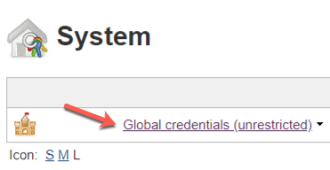

# Lesson A - Setting up Continuous Delivery for the Timesheet Application

# Brief Overview
Imagine that you freshly joined a new development team. The team is new to cloud development and started recently to work on a new project, the Timesheet Application.

The Timesheet application helps companies to implment an approval workflow for the tracking of employee working hours. To benefit from the unique opportunities of building applications in the cloud, the team decided to build the Timesheet application on SAP Cloud Platform. Thanks to the SAP Cloud SDK, the team was quickly able to build the necessary integrations to SAP SuccessFactors for retrieving employee data and SAP S/4HANA for storing timesheet entries. The webservices and the persistence for timesheet entry drafts are implemented based on the SAP Cloud Application programming model.

Thanks to your productive colleagues, the application is already in a good initial state. Now your Product Owner wants to start to roll out the application to first customers to gather their feedback. It is expected, that those customers will have a lot of feedback and your team wants to be able to quickly react to it. Furthermore, as with every new application, customers might run into glitches that you didn't discover during development. Therefore, your team wants to be able to confidently deliver new versions of the Timesheet Application on a sub-daily basis - in short your team wants to start practicing *Continuous Delivery*. This requires a high level of automation of your whole build, test, quality assurance, and delivery activities, typically achieved by the implementation of a Continuous Delivery pipeline. 

Implementing and maintaining Continuous Delivery environments and pipelines is a challenging task that requires special expertise and an increasing amount of effort as your application and pipeline matures. In many development teams, this becomes the full-time job of a team member. Imagine how much additional customer value you could create if this person would be relieved from his burden and could start working on value-adding features that delight customers.

Luckily, if you are building your application with the SAP Cloud Application Programming model and / or the SAP Cloud SDK, we can help you! SAP's open source Project Piper provides efficient ready-made tools to kickstart your Continuous Delviery endevours. For our use case it offers a containerized Continuous Delivery infrastructure which can be used to easily instantiate Continuous Delivery servers on any host with Docker installed or on Kubernetes clusters. In this environemt, we can then execute the ready-made SAP Cloud SDK Continous Delivery pipeline which does the actual work of building a change, executing relevant tests and quality checks, and finally deploying it to production if everything went well.

## Estimated Time: 60 minutes

## What you will learn
 - How to setup Continous Delivery within minutes with the help of Project Piper Cx Server.
 - How to execute blue-green deployments of you application out-of-the-box.
 - Best practices for continous delivery.

## Exercise Description 
 - We are going to setup a Jenkins server from scratch. Don't get scared, with the help of Cx Server this is more than easy.
 - After that we are going to setup our user credentials and make the initial configuration
 - Lastly, we are going to build a Pipeline which will execute blue-grenn deployment of our application.

* Exercise A1 - [Starting Your Local Continuous Delivery Server](../../exercises/A1/README.md)
* Exercise A2 - [Creating your first pipeline](../../exercises/A2/README.md)

[[ Overview page](../../README.md) ｜ [ Start Exercise](../../exercises/A1/README.md)]

Finally, we just need to commit and push our new configuration to the central source code repository. On the lower left, click on `Version Control` to open the version control pane.

 Now click on `Local Changes` and then on the green "Commit" checkmark.

In the appearing dialog, perform the following steps:
* double check that your participant id is correctly filled into the placeholders in `pipeline_config.yml`
* enter a commit message (e.g., "adapt pipeline config")
* click on the down-facing arrow in the `Commit` button
* select `Commit and Push`

After pushing your changes succesfully, you will see the following pop-up on the bottom right.

The project is now fully configured for Continuous Delivery. Wasn't that easy!?
Next, let's configure our Continuous Delivery server.

## Configure Your Continuous Delivery Server

After your project is configured, let's set up the Jenkins build job for running the pipeline. We will first create the necessary deploymnent credentials and then a build job for our project.

Re-open your browser, navigate to the Jenkins user interface (http://localhost:8080).

### Create Deployment Credentials

The Continuous Delivery pipeline of your project will finally deploy to the SAP Cloud Platform space that we created for you for the purpose of this session. Before we can run it, we need to save the deployment credentials in Jenkins. This procedure is a bit cumbersome - so strictly follow the steps described.

* On the Jenkins landing page, look out for the menu on the left and click on `Credentials`. 

* Click on the `System` sub-item that appeared below `Credentials`. 

* Look out for the `System` section and click on `Global credentials (unrestricted)`. 

* In the menu section, you should now see the item `Add Credentials` - click on it.
 

* Now you should see the form to enter a new credentials entry. Based on `pipeline_config.yml` which we edited earlier, the pipeline will retrieve the deployment credentials from the entry with ID `CF-DEPLOY`. To create it, enter the following data. Make sure that you use the username and password that was handed out to you. 

* Finally, click on `OK` and navigate back to the Jenkins landing page (http://localhost:8080).

Next, we will create the build job for our project.

### Create Build Job

We will now create a build job for our project which will run the pipeline for our branch.

* On the Jenkins landing page, click on `create new jobs`. 
 

* Enter `timesheet` as item name. 
* SAP Cloud SDK Continuous Delivery pipelines are designed for multi-branch git repositories. Therefore, select `Multibranch Pipeline` as job type.
 
* Finally, click on `OK`.

Next, we will connect the source code repository to the new job.

* In the section `Branch Sources`, click on the button `Add source` and then on `Git`.
 

* In the new pane, enter the git url `http://cloudl000024.wdf.sap.corp:8080/teched/caa381` as project repository.

By default, the multibranch pipelines will execute the pipeline for all branches of our repository. This is usually the desired behavior. However, since we are using a joint git repository in this hands-on session, we need to make sure that our build server does not start start executing the pipelines of our co-participants. We can do this by limiting the build job to our branch only:

* Find the `Behaviors` section
* Click on the button `Add`
* In the menu, click on `Filter by name (with regular expression)`
 

* Then navigate to the new `Filter by name (with regular expression)` section and enter the name of your branch (participant id) in the text field as shown below.
 

* Finally, click on `Save`.

Now, Jenkins will automatically scan the repository, discover your branch, and then execute the pipeline for it.
Make sure that Jenkins properly detects your branch (and only your branch). The corresponding output should look like the log below.

