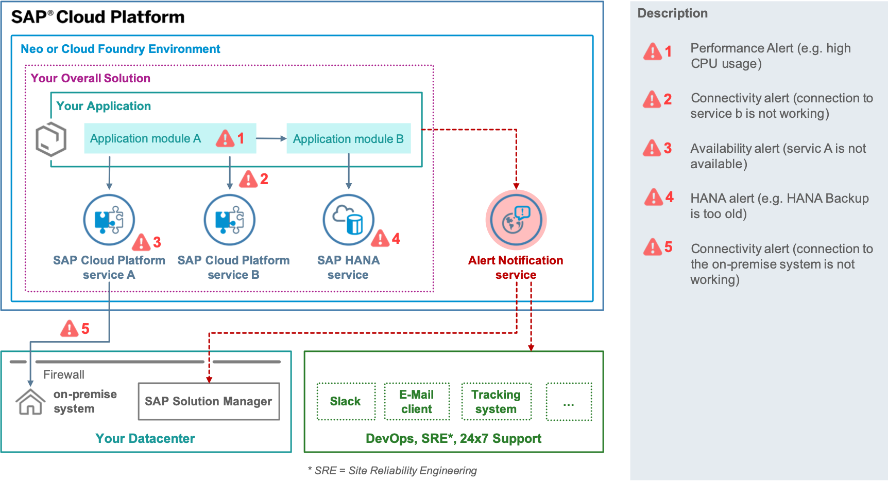

# Lesson B - Obeservability and Control of Your Application

# Brief Overview
Once we have the setup of our deployment and development infrastructure, we have the assurance that we can freely deploy our application onto the Cloud Platform from anywhere and anytime we want. However, once the application is operational, we are going to face another challenge. What is the prio 0 task that every DevOps engineer has? Keep the site alive (or Live Site First, as you might have heard it). We should keep our business running no matter what. Therefore we should have the means for monitoring and control of our application. Into that exercise, we are going to learn how to understand instantly about problems with our productive application. We are going to use the SAP Cloud Platform Alert Notification service, which allows us to understand abouth those problems via the channel we like.

# Objective 

Alert Notification is an SAP Cloud Platform based service which provides you with the ability to instantly understand whenever there’s an issue with your cloud application or its dependencies. Furthermore, it is notifying you via any channel of alert management you like – no matter if this is mail, some corporate chat (like Slack), ticketing system or even SAP Solution Manager or Focused Run for SAP Solution Manager.

## Estimated Time: 60 minutes

## What you will learn
 - What is SAP Cloud Platform Alert Notification and how to use it
 - Best practices for alert managment of your cloud application
 - How to consume alerts via different channels like mail and Slack.

## Exercise Description 
 - We are going to define an alert which notifies us every time the state of our application changes. For example, when it goes from start to stop or whenever its runtime crashes. We are going to receive a Slack message about those changes.
 - We are going to explore the code of our application and learn how we can make it post the so-called custom alerts. The application itself produces those alerts and one can use them for very application-specific situations. For example, if we have a specific exceptional situation in the application and we want to understand about it, this is going to happen with custom alerts.
 - Lastly, we are going to subscribe ourselves for such kind of custom alert and receive it via Slack or mail

* Exercise B1 - [Configure Alerts for App State Changes](../../exercises/B1/README.md)
* Exercise B2 - [Configure Custom Alerts](../../exercises/B2/README.md)
* Exercise B3 - [Export Configuration](../../exercises/B3/README.md)

[[ Overview page](../../README.md) ｜ [ Start Exercise](../../exercises/B1/README.md)]
