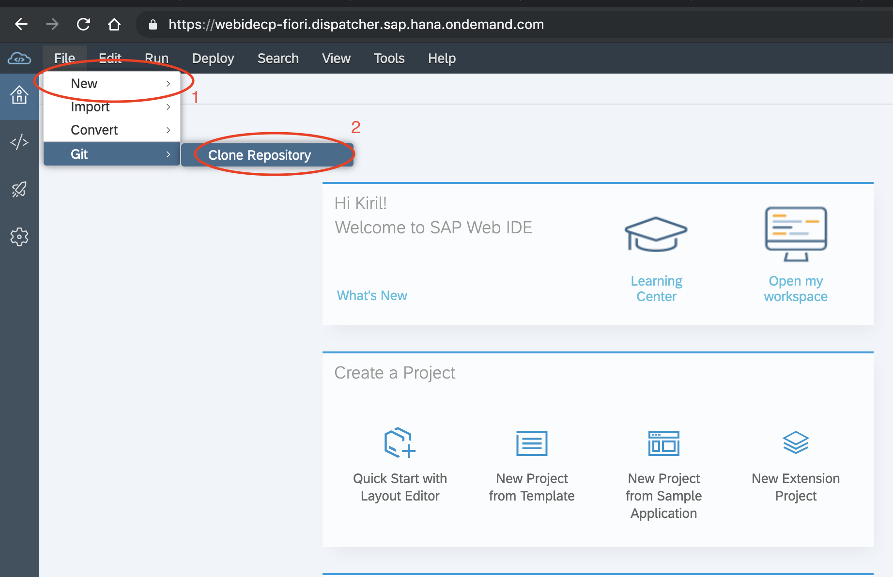
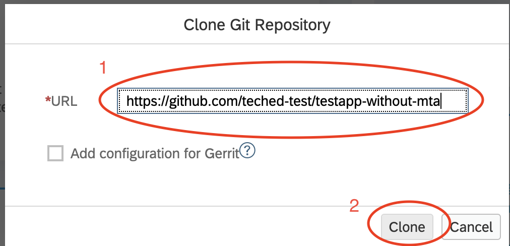
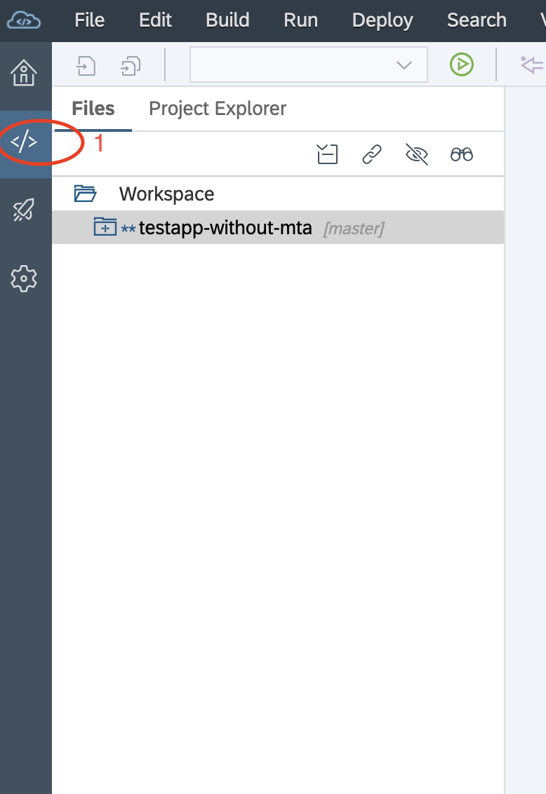
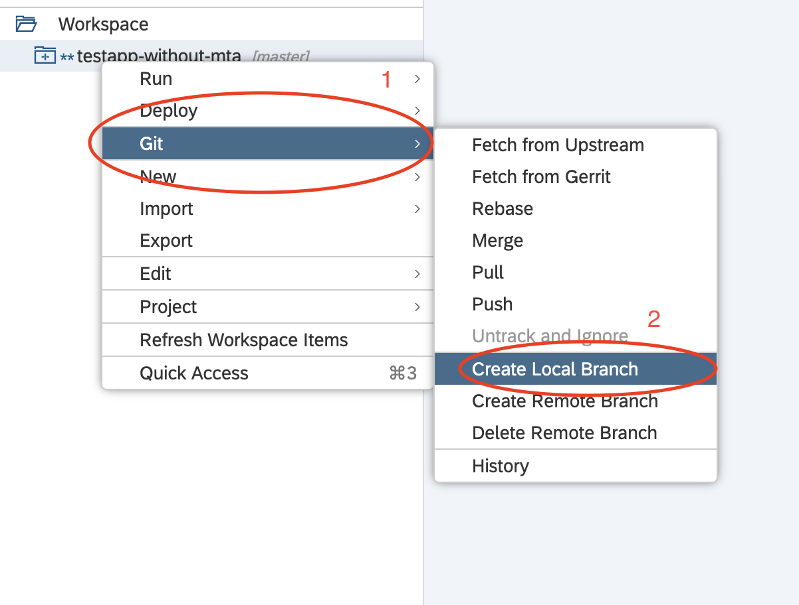
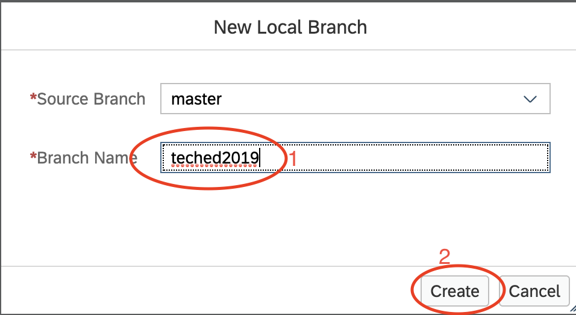

# Lesson A - Modeling and Test of your application
# Preparation - Import the application from GitHub to SAP Web IDE

## Objective
Our first objective is to set the stage for this exercise. As mentioned in the [exercise A overview page](../../overviews/A/README.md) our application is already in GitHub, so now we are going to import it and test it into SAP Web IDE and then deploy it manually on SAP Cloud Platform

### What you will learn during this preparation
During this par you will learn how to import an existing application from GitHub to SAP Web IDE.

## Estimated time
10 minutes 

# 1. Explore Project
First, let's have short esxplorataion of our project. You can find it [here](https://github.com/teched-test/testapp-without-mta). As you will most probably notice this is SAP Cloud Application Programming Model based application. SAP Cloud Application Programming Model el enables you to quickly create business applications by allowing you to focus on your domain logic. It offers a consistent end-to-end programming model that includes languages, libraries and APIs tailored for full-stack development on SAP Cloud Platform. It provides you with out-of-the-box Databse support, Data and service models and many more. To learn more about SAP Cloud Application Programming model click [here](https://help.sap.com/viewer/65de2977205c403bbc107264b8eccf4b/Cloud/en-US/00823f91779d4d42aa29a498e0535cdf.html)

# 2. Access SAP Web IDE and import github project
Let's open the SAP Web IDE. In order to do that simply follow
(this link)[https://webidecp-fiori.dispatcher.sap.hana.ondemand.com/] and **authenticate with the P-user and password provided on your handout materials.**

Once you do this, you will be at the entry page of SAP Web IDE. It is time to clone our github repository into Web IDE. To do so click on **File > Git > Clone Repository**, as shown on the picture below



In the appeared pop-up type the github repository of our application 
```
https://github.com/teched-test/testapp-without-mta
```
then click on the **Clone** button, as shown on the picture below


In the appeared pop-up named **Git Ignore System Files** click on the **Do it later** button, as shown below


Your project is now imported into SAP Web IDE. In order access it simply open the development pane.


What is left is to create a local branch. In order to do so **right click on the project > Git > Create Local Branch**


Name your branch whatever you like, for example **teched2019** and click on the **Create** button.



[ Overview page](../../README.md) ｜ [ Next Exercise](../../exercises/A1/README.md)
