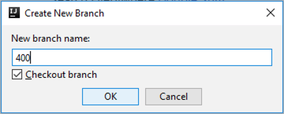

# Preparation

This preparation is **mandatory** for all exercises. We will perform the following steps:
* Start our local development environment
* Check out the latest source code version of the Timesheet Application
* Create personal development branch in the source code repository

## Estimated Time: 10 minutes

## Start IntelliJ IDE
Before we get started with real work, we need to prepare our work environment. In this session, we will use IntelliJ as our IDE. To start IntelliJ, please navigate to `D:\Files\Session\CAA381` and click on the IntelliJ shortcut.

## Pull Latest Sources
We have a copy of the Timesheet Application checked out on our machine. However, our colleagues continued working on it during the last days. Therefore, we need to check out the lastest sources after IntelliJ started. On the top right, we can click on the blue `Update Project` arrow to start the update.

After the latest sources have been successfully pulled, we will see a success indicator on the bottom right.

## Create Personal Branch

Now, let's create our personal branch for our source code changes. On the bottom right, click on `master` and then select `New branch` from the popup menu.

In the next dialogue, enter your ***personal participant id*** which has been handed out to you and click on `OK`.

    > TODO Check if MTA.YAML needs to be customized. If not, remove "participantId" from mta.yaml.

Finally, we can push our branch to the central source code repository. In the top menu, click on `VCS > Git > Push`.

In the appearing dialogue, click `Push`.

Success! You are now ready to continue with lesson A.

[ Overview page](../README.md) ｜ (../overviews/A/README.md) [ Start Lesson A]
