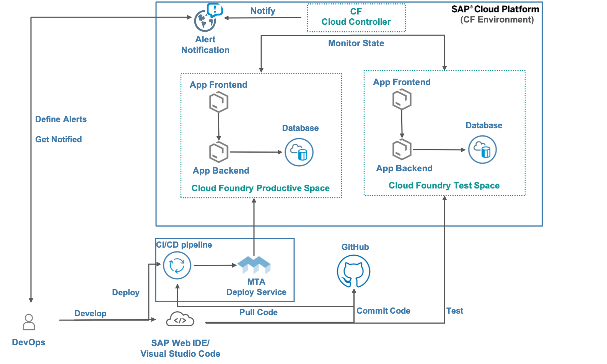

## Description
his guide has been created for the SAP TechEd 2019 session CA028. Taking your DevOps skills with SAP Cloud Platform to the next level.
In this session participants will learn best practices how to operate their Cloud Application deployed on SAP Cloud Platform.

## Used Landscape 
The different systems and their relation we use for our scenario are sketched out by the following landscape diagram.
